# HEX IAM - Architecture Documentation

This document provides a comprehensive overview of the system architecture using mermaid.live compatible diagrams.

---

## System Overview

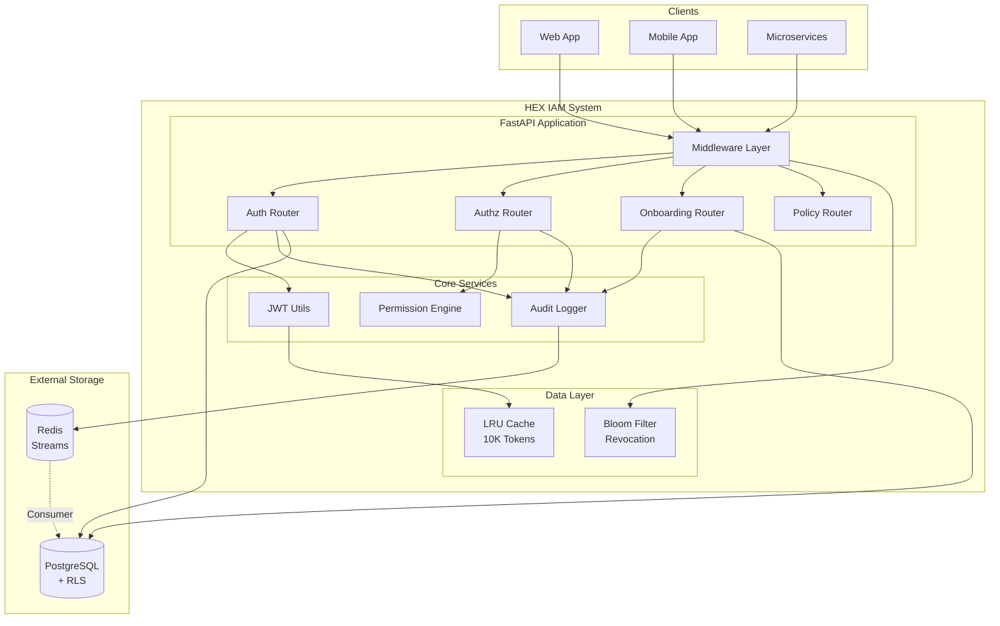
```mermaid
flowchart TB
    subgraph Clients
        WEB[Web App]
        MOB[Mobile App]
        SVC[Microservices]
    end

    subgraph "HEX IAM System"
        subgraph "FastAPI Application"
            MW[Middleware Layer]
            AUTH[Auth Router]
            AUTHZ[Authz Router]
            ONB[Onboarding Router]
            POLICY[Policy Router]
        end

        subgraph "Core Services"
            JWT[JWT Utils]
            PERM[Permission Engine]
            AUDIT[Audit Logger]
        end

        subgraph "Data Layer"
            CACHE[LRU Cache<br/>10K Tokens]
            BLOOM[Bloom Filter<br/>Revocation]
        end
    end

    subgraph "External Storage"
        PG[(PostgreSQL<br/>+ RLS)]
        REDIS[(Redis<br/>Streams)]
    end

    WEB & MOB & SVC --> MW
    MW --> AUTH & AUTHZ & ONB & POLICY
    AUTH --> JWT
    AUTHZ --> PERM
    AUTH & AUTHZ & ONB --> AUDIT
    JWT --> CACHE
    MW --> BLOOM
    AUTH & ONB --> PG
    AUDIT --> REDIS
    REDIS -.->|Consumer| PG
```

---

## Data Flow Diagram

### Authentication Flow

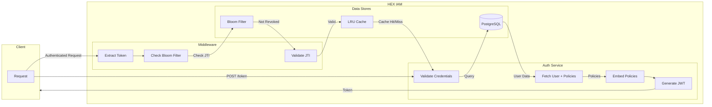
```mermaid
flowchart LR
    subgraph Client
        REQ[Request]
    end

    subgraph "HEX IAM"
        subgraph Middleware
            M1[Extract Token]
            M2[Check Bloom Filter]
            M3[Validate JTI]
        end

        subgraph "Auth Service"
            A1[Validate Credentials]
            A2[Fetch User + Policies]
            A3[Generate JWT]
            A4[Embed Policies]
        end

        subgraph "Data Stores"
            DB[(PostgreSQL)]
            BF[Bloom Filter]
            LC[LRU Cache]
        end
    end

    REQ -->|POST /token| A1
    A1 -->|Query| DB
    DB -->|User Data| A2
    A2 -->|Policies| A4
    A4 --> A3
    A3 -->|Token| Client

    REQ -->|Authenticated Request| M1
    M1 --> M2
    M2 -->|Check JTI| BF
    BF -->|Not Revoked| M3
    M3 -->|Valid| LC
    LC -->|Cache Hit/Miss| A1
```

### Authorization Flow

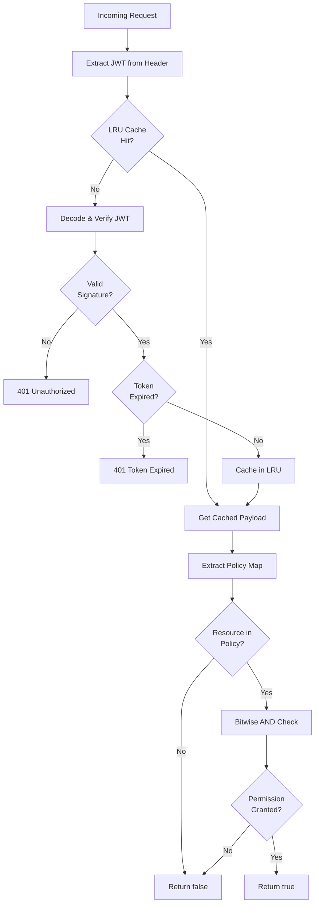
```mermaid
flowchart TD
    REQ[Incoming Request] --> EXT[Extract JWT from Header]
    EXT --> CACHE{LRU Cache<br/>Hit?}
    
    CACHE -->|Yes| PAYLOAD[Get Cached Payload]
    CACHE -->|No| DECODE[Decode & Verify JWT]
    
    DECODE --> VALIDATE{Valid<br/>Signature?}
    VALIDATE -->|No| REJECT1[401 Unauthorized]
    VALIDATE -->|Yes| EXPIRED{Token<br/>Expired?}
    
    EXPIRED -->|Yes| REJECT2[401 Token Expired]
    EXPIRED -->|No| STORE[Cache in LRU]
    STORE --> PAYLOAD
    
    PAYLOAD --> EXTRACT[Extract Policy Map]
    EXTRACT --> LOOKUP{Resource in<br/>Policy?}
    
    LOOKUP -->|No| DENY[Return false]
    LOOKUP -->|Yes| BITWISE[Bitwise AND Check]
    
    BITWISE --> RESULT{Permission<br/>Granted?}
    RESULT -->|Yes| ALLOW[Return true]
    RESULT -->|No| DENY
```

---

## Sequence Diagrams

### Login Sequence

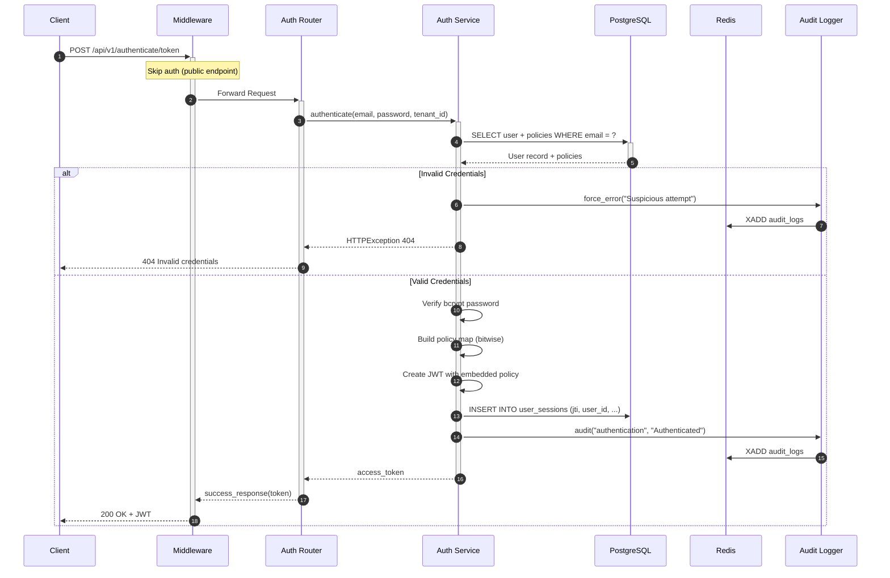
```mermaid
sequenceDiagram
    autonumber
    participant C as Client
    participant M as Middleware
    participant A as Auth Router
    participant S as Auth Service
    participant DB as PostgreSQL
    participant R as Redis
    participant L as Audit Logger

    C->>+M: POST /api/v1/authenticate/token
    Note over M: Skip auth (public endpoint)
    M->>+A: Forward Request
    A->>+S: authenticate(email, password, tenant_id)
    
    S->>+DB: SELECT user + policies WHERE email = ?
    DB-->>-S: User record + policies
    
    alt Invalid Credentials
        S->>L: force_error("Suspicious attempt")
        L->>R: XADD audit_logs
        S-->>A: HTTPException 404
        A-->>C: 404 Invalid credentials
    else Valid Credentials
        S->>S: Verify bcrypt password
        S->>S: Build policy map (bitwise)
        S->>S: Create JWT with embedded policy
        S->>DB: INSERT INTO user_sessions (jti, user_id, ...)
        S->>L: audit("authentication", "Authenticated")
        L->>R: XADD audit_logs
        S-->>-A: access_token
        A-->>-M: success_response(token)
        M-->>-C: 200 OK + JWT
    end
```

### Authorization Check Sequence

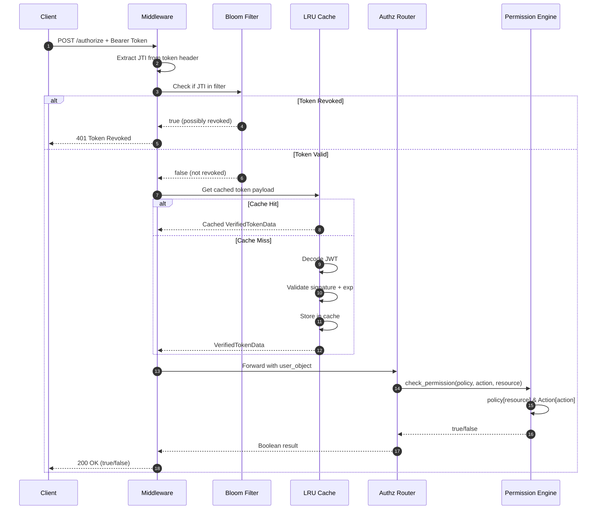
```mermaid
sequenceDiagram
    autonumber
    participant C as Client
    participant M as Middleware
    participant BF as Bloom Filter
    participant LC as LRU Cache
    participant AZ as Authz Router
    participant PE as Permission Engine

    C->>M: POST /authorize + Bearer Token
    M->>M: Extract JTI from token header
    M->>BF: Check if JTI in filter
    
    alt Token Revoked
        BF-->>M: true (possibly revoked)
        M-->>C: 401 Token Revoked
    else Token Valid
        BF-->>M: false (not revoked)
        M->>LC: Get cached token payload
        
        alt Cache Hit
            LC-->>M: Cached VerifiedTokenData
        else Cache Miss
            LC->>LC: Decode JWT
            LC->>LC: Validate signature + exp
            LC->>LC: Store in cache
            LC-->>M: VerifiedTokenData
        end
        
        M->>AZ: Forward with user_object
        AZ->>PE: check_permission(policy, action, resource)
        PE->>PE: policy[resource] & Action[action]
        PE-->>AZ: true/false
        AZ-->>M: Boolean result
        M-->>C: 200 OK (true/false)
    end
```

### Token Refresh Sequence

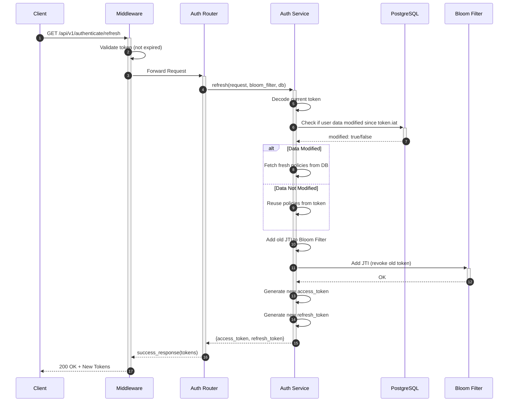
```mermaid
sequenceDiagram
    autonumber
    participant C as Client
    participant M as Middleware
    participant A as Auth Router
    participant S as Auth Service
    participant DB as PostgreSQL
    participant BF as Bloom Filter

    C->>+M: GET /api/v1/authenticate/refresh
    M->>M: Validate token (not expired)
    M->>+A: Forward Request
    A->>+S: refresh(request, bloom_filter, db)
    
    S->>S: Decode current token
    S->>+DB: Check if user data modified since token.iat
    DB-->>-S: modified: true/false
    
    alt Data Modified
        S->>S: Fetch fresh policies from DB
    else Data Not Modified
        S->>S: Reuse policies from token
    end
    
    S->>S: Add old JTI to Bloom Filter
    S->>+BF: Add JTI (revoke old token)
    BF-->>-S: OK
    
    S->>S: Generate new access_token
    S->>S: Generate new refresh_token
    S-->>-A: {access_token, refresh_token}
    A-->>-M: success_response(tokens)
    M-->>-C: 200 OK + New Tokens
```

### Tenant Onboarding Sequence

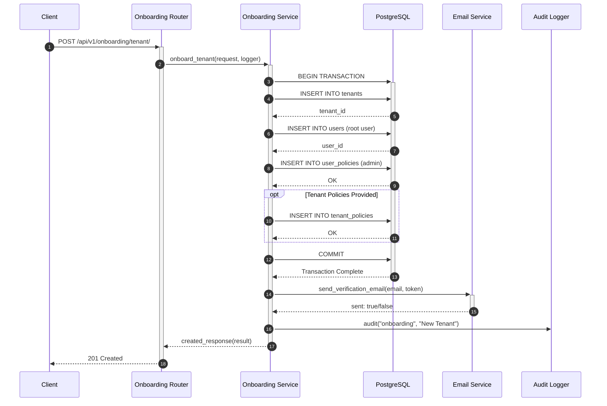
```mermaid
sequenceDiagram
    autonumber
    participant C as Client
    participant O as Onboarding Router
    participant S as Onboarding Service
    participant DB as PostgreSQL
    participant E as Email Service
    participant L as Audit Logger

    C->>+O: POST /api/v1/onboarding/tenant/
    O->>+S: onboard_tenant(request, logger)
    
    S->>+DB: BEGIN TRANSACTION
    
    S->>DB: INSERT INTO tenants
    DB-->>S: tenant_id
    
    S->>DB: INSERT INTO users (root user)
    DB-->>S: user_id
    
    S->>DB: INSERT INTO user_policies (admin)
    DB-->>S: OK
    
    opt Tenant Policies Provided
        S->>DB: INSERT INTO tenant_policies
        DB-->>S: OK
    end
    
    S->>DB: COMMIT
    DB-->>-S: Transaction Complete
    
    S->>+E: send_verification_email(email, token)
    E-->>-S: sent: true/false
    
    S->>L: audit("onboarding", "New Tenant")
    
    S-->>-O: created_response(result)
    O-->>-C: 201 Created
```

### Bulk Session Logout Sequence

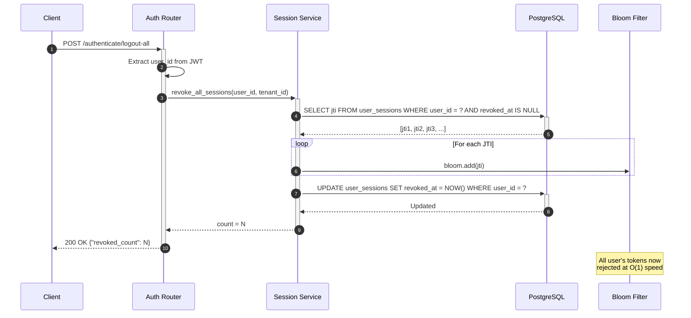
```mermaid
sequenceDiagram
    autonumber
    participant C as Client
    participant A as Auth Router
    participant SS as Session Service
    participant DB as PostgreSQL
    participant BF as Bloom Filter

    C->>+A: POST /authenticate/logout-all
    A->>A: Extract user_id from JWT
    A->>+SS: revoke_all_sessions(user_id, tenant_id)
    
    SS->>+DB: SELECT jti FROM user_sessions WHERE user_id = ? AND revoked_at IS NULL
    DB-->>-SS: [jti1, jti2, jti3, ...]
    
    loop For each JTI
        SS->>BF: bloom.add(jti)
    end
    
    SS->>+DB: UPDATE user_sessions SET revoked_at = NOW() WHERE user_id = ?
    DB-->>-SS: Updated
    
    SS-->>-A: count = N
    A-->>-C: 200 OK {"revoked_count": N}
    
    Note over BF: All user's tokens now<br/>rejected at O(1) speed
```

---

## Activity Diagrams

### Request Processing Activity

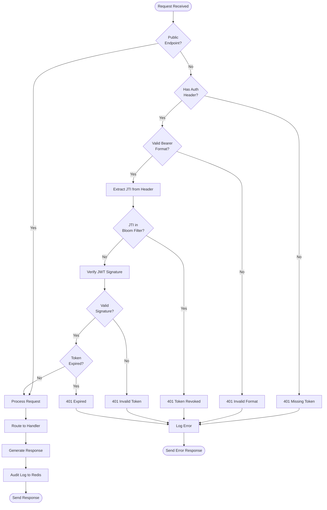
```mermaid
flowchart TD
    START([Request Received]) --> CHECK_PATH{Public<br/>Endpoint?}
    
    CHECK_PATH -->|Yes| PROCESS[Process Request]
    CHECK_PATH -->|No| HAS_TOKEN{Has Auth<br/>Header?}
    
    HAS_TOKEN -->|No| ERR1[401 Missing Token]
    HAS_TOKEN -->|Yes| PARSE{Valid Bearer<br/>Format?}
    
    PARSE -->|No| ERR2[401 Invalid Format]
    PARSE -->|Yes| GET_JTI[Extract JTI from Header]
    
    GET_JTI --> BLOOM{JTI in<br/>Bloom Filter?}
    
    BLOOM -->|Yes| ERR3[401 Token Revoked]
    BLOOM -->|No| VERIFY[Verify JWT Signature]
    
    VERIFY --> VALID{Valid<br/>Signature?}
    
    VALID -->|No| ERR4[401 Invalid Token]
    VALID -->|Yes| EXPIRED{Token<br/>Expired?}
    
    EXPIRED -->|Yes| ERR5[401 Expired]
    EXPIRED -->|No| PROCESS
    
    PROCESS --> ROUTE[Route to Handler]
    ROUTE --> RESPONSE[Generate Response]
    RESPONSE --> LOG[Audit Log to Redis]
    LOG --> DONE([Send Response])
    
    ERR1 & ERR2 & ERR3 & ERR4 & ERR5 --> ERROR_LOG[Log Error]
    ERROR_LOG --> ERROR_RESP([Send Error Response])
```

### Permission Check Activity

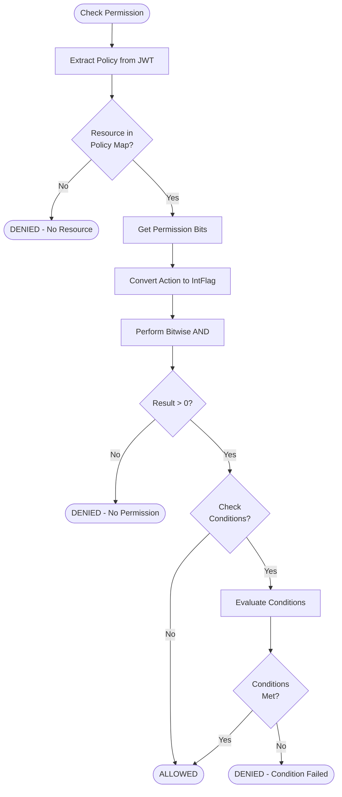
```mermaid
flowchart TD
    START([Check Permission]) --> EXTRACT[Extract Policy from JWT]
    EXTRACT --> HAS_RESOURCE{Resource in<br/>Policy Map?}
    
    HAS_RESOURCE -->|No| DENY1([DENIED - No Resource])
    HAS_RESOURCE -->|Yes| GET_BITS[Get Permission Bits]
    
    GET_BITS --> CONVERT[Convert Action to IntFlag]
    CONVERT --> BITWISE[Perform Bitwise AND]
    
    BITWISE --> RESULT{Result > 0?}
    
    RESULT -->|No| DENY2([DENIED - No Permission])
    RESULT -->|Yes| CHECK_COND{Check<br/>Conditions?}
    
    CHECK_COND -->|No| ALLOW([ALLOWED])
    CHECK_COND -->|Yes| EVAL_COND[Evaluate Conditions]
    
    EVAL_COND --> COND_MET{Conditions<br/>Met?}
    
    COND_MET -->|Yes| ALLOW
    COND_MET -->|No| DENY3([DENIED - Condition Failed])
```

### Audit Logging Activity

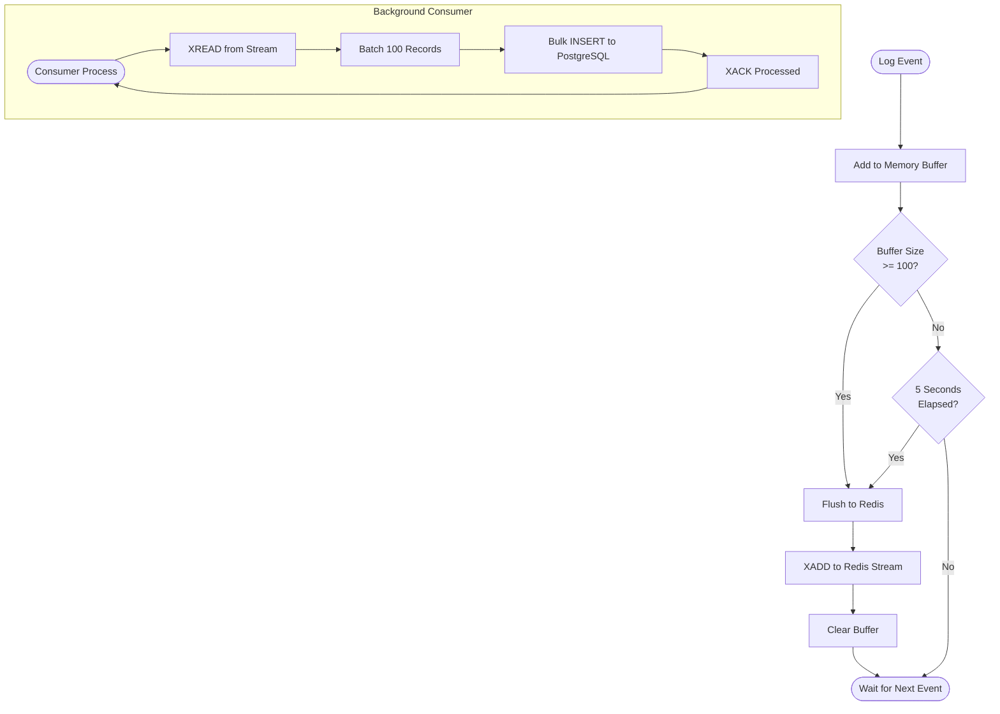
```mermaid
flowchart TD
    START([Log Event]) --> BUFFER[Add to Memory Buffer]
    BUFFER --> CHECK_SIZE{Buffer Size<br/>>= 100?}
    
    CHECK_SIZE -->|Yes| FLUSH[Flush to Redis]
    CHECK_SIZE -->|No| CHECK_TIME{5 Seconds<br/>Elapsed?}
    
    CHECK_TIME -->|Yes| FLUSH
    CHECK_TIME -->|No| WAIT([Wait for Next Event])
    
    FLUSH --> XADD[XADD to Redis Stream]
    XADD --> CLEAR[Clear Buffer]
    CLEAR --> WAIT
    
    subgraph "Background Consumer"
        CONSUMER([Consumer Process])
        CONSUMER --> XREAD[XREAD from Stream]
        XREAD --> BATCH[Batch 100 Records]
        BATCH --> INSERT[Bulk INSERT to PostgreSQL]
        INSERT --> ACK[XACK Processed]
        ACK --> CONSUMER
    end
```

---

## Component Architecture


```mermaid
flowchart TB
    subgraph "API Layer"
        direction LR
        R1[auth.py<br/>/authenticate/*]
        R2[authz.py<br/>/authorize/*]
        R3[onboarding.py<br/>/onboarding/*]
        R4[policies.py<br/>/policies/*]
        R5[tenants.py<br/>/tenants/*]
        R6[users.py<br/>/users/*]
    end
    
    subgraph "SSO/OIDC Layer"
        direction LR
        O1[oidc.py<br/>/oidc/authorize]
        O2[clients.py<br/>/oidc/clients]
        O3[signup.py<br/>/oidc/signup]
        O4[discovery.py<br/>/.well-known/*]
    end
    
    subgraph "Service Layer"
        direction LR
        S1[auth.py<br/>Authentication]
        S2[session_service.py<br/>Session Mgmt]
        S3[onboarding.py<br/>Tenant Setup]
        S4[policy_service.py<br/>Policy CRUD]
        S5[tenant_service.py<br/>Settings]
        S6[oidc_service.py<br/>OAuth/OIDC]
    end
    
    subgraph "Core Layer"
        direction LR
        C1[jwt_utils.py<br/>Token Handling]
        C2[responses.py<br/>orjson + dataclass]
        C3[security.py<br/>Password Hashing]
        C4[token_revocation.py<br/>Bloom Filter + Stream]
    end
    
    subgraph "Infrastructure"
        direction LR
        I1[redis_logger.py<br/>Audit Logging]
        I2[database/__init__.py<br/>DB Pool + RLS]
        I3[exceptions/*<br/>Error Handling]
    end
    
    R1 --> S1 & S2
    R2 --> S1
    R3 --> S3
    R4 --> S4
    R5 --> S5
    R6 --> S1
    
    O1 & O2 & O3 --> S6
    
    S1 & S2 & S6 --> C1
    S1 & S2 & S3 & S4 & S5 & S6 --> C2
    S1 & S3 --> C3
    S1 & S2 --> C4
    
    S1 & S2 & S3 & S4 & S5 & S6 --> I1
    S1 & S2 & S3 & S4 & S5 & S6 --> I2
    R1 & R2 & R3 & R4 & R5 & R6 & O1 & O2 & O3 --> I3
```

---

## Database Schema ER Diagram

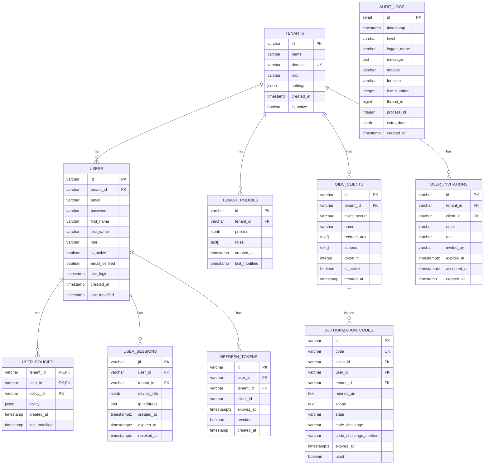
```mermaid
erDiagram
    TENANTS ||--o{ USERS : has
    TENANTS ||--o{ TENANT_POLICIES : has
    TENANTS ||--o{ OIDC_CLIENTS : has
    TENANTS ||--o{ USER_INVITATIONS : has
    USERS ||--o{ USER_POLICIES : has
    USERS ||--o{ USER_SESSIONS : has
    USERS ||--o{ REFRESH_TOKENS : has
    OIDC_CLIENTS ||--o{ AUTHORIZATION_CODES : issues
    
    TENANTS {
        varchar id PK
        varchar name
        varchar domain UK
        varchar root
        jsonb settings
        timestamp created_at
        boolean is_active
    }
    
    USERS {
        varchar id PK
        varchar tenant_id FK
        varchar email
        varchar password
        varchar first_name
        varchar last_name
        varchar role
        boolean is_active
        boolean email_verified
        timestamp last_login
        timestamp created_at
        timestamp last_modified
    }
    
    USER_POLICIES {
        varchar tenant_id PK,FK
        varchar user_id PK,FK
        varchar policy_id PK
        jsonb policy
        timestamp created_at
        timestamp last_modified
    }
    
    TENANT_POLICIES {
        varchar id PK
        varchar tenant_id FK
        jsonb policies
        text[] roles
        timestamp created_at
        timestamp last_modified
    }
    
    OIDC_CLIENTS {
        varchar id PK
        varchar tenant_id FK
        varchar client_secret
        varchar name
        text[] redirect_uris
        text[] scopes
        integer token_ttl
        boolean is_active
        timestamp created_at
    }
    
    USER_SESSIONS {
        varchar jti PK
        varchar user_id FK
        varchar tenant_id FK
        jsonb device_info
        inet ip_address
        timestamptz created_at
        timestamptz expires_at
        timestamptz revoked_at
    }
    
    REFRESH_TOKENS {
        varchar jti PK
        varchar user_id FK
        varchar tenant_id FK
        varchar client_id
        timestamptz expires_at
        boolean revoked
        timestamp created_at
    }
    
    AUTHORIZATION_CODES {
        varchar id PK
        varchar code UK
        varchar client_id FK
        varchar user_id FK
        varchar tenant_id FK
        text redirect_uri
        text scope
        varchar state
        varchar code_challenge
        varchar code_challenge_method
        timestamptz expires_at
        boolean used
    }
    
    USER_INVITATIONS {
        varchar id PK
        varchar tenant_id FK
        varchar client_id FK
        varchar email
        varchar role
        varchar invited_by
        timestamptz expires_at
        timestamptz accepted_at
        timestamp created_at
    }
    
    AUDIT_LOGS {
        serial id PK
        timestamp timestamp
        varchar level
        varchar logger_name
        text message
        varchar module
        varchar function
        integer line_number
        bigint thread_id
        integer process_id
        jsonb extra_data
        timestamp created_at
    }
```

---

## Deployment Architecture

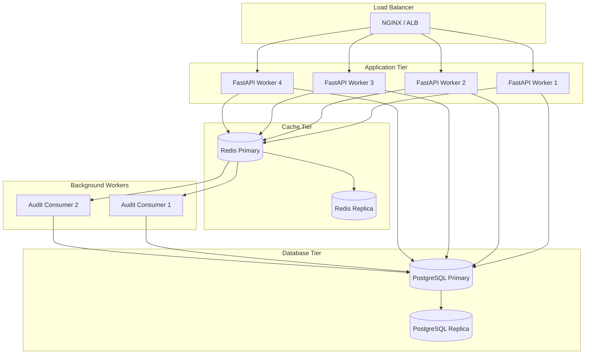
```mermaid
flowchart TB
    subgraph "Load Balancer"
        LB[NGINX / ALB]
    end
    
    subgraph "Application Tier"
        APP1[FastAPI Worker 1]
        APP2[FastAPI Worker 2]
        APP3[FastAPI Worker 3]
        APP4[FastAPI Worker 4]
    end
    
    subgraph "Cache Tier"
        REDIS1[(Redis Primary)]
        REDIS2[(Redis Replica)]
    end
    
    subgraph "Database Tier"
        PG1[(PostgreSQL Primary)]
        PG2[(PostgreSQL Replica)]
    end
    
    subgraph "Background Workers"
        W1[Audit Consumer 1]
        W2[Audit Consumer 2]
    end
    
    LB --> APP1 & APP2 & APP3 & APP4
    APP1 & APP2 & APP3 & APP4 --> REDIS1
    REDIS1 --> REDIS2
    APP1 & APP2 & APP3 & APP4 --> PG1
    PG1 --> PG2
    REDIS1 --> W1 & W2
    W1 & W2 --> PG1
```

---

## Security Architecture

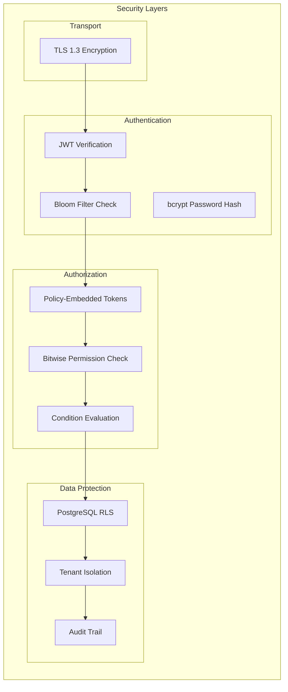
```mermaid
flowchart TD
    subgraph "Security Layers"
        direction TB
        
        subgraph "Transport"
            TLS[TLS 1.3 Encryption]
        end
        
        subgraph "Authentication"
            JWT_V[JWT Verification]
            BLOOM_C[Bloom Filter Check]
            BCRYPT[bcrypt Password Hash]
        end
        
        subgraph "Authorization"
            POLICY[Policy-Embedded Tokens]
            BITWISE[Bitwise Permission Check]
            COND[Condition Evaluation]
        end
        
        subgraph "Data Protection"
            RLS[PostgreSQL RLS]
            TENANT[Tenant Isolation]
            AUDIT[Audit Trail]
        end
    end
    
    TLS --> JWT_V
    JWT_V --> BLOOM_C
    BLOOM_C --> POLICY
    POLICY --> BITWISE
    BITWISE --> COND
    COND --> RLS
    RLS --> TENANT
    TENANT --> AUDIT
```

---

## OAuth 2.0 / OIDC Identity Provider Flow

### Authorization Code Flow (with PKCE)

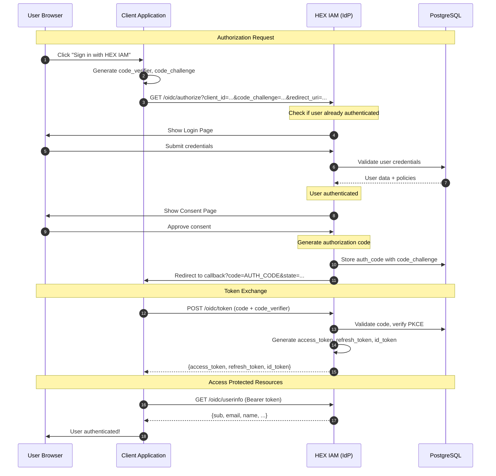
```mermaid
sequenceDiagram
    autonumber
    participant U as User Browser
    participant App as Client Application
    participant IdP as HEX IAM (IdP)
    participant DB as PostgreSQL

    Note over U,DB: Authorization Request
    U->>App: Click "Sign in with HEX IAM"
    App->>App: Generate code_verifier, code_challenge
    App->>IdP: GET /oidc/authorize?client_id=...&code_challenge=...&redirect_uri=...
    
    Note over IdP: Check if user already authenticated
    IdP->>U: Show Login Page
    U->>IdP: Submit credentials
    IdP->>DB: Validate user credentials
    DB-->>IdP: User data + policies
    
    Note over IdP: User authenticated
    IdP->>U: Show Consent Page
    U->>IdP: Approve consent
    
    Note over IdP: Generate authorization code
    IdP->>DB: Store auth_code with code_challenge
    IdP->>App: Redirect to callback?code=AUTH_CODE&state=...
    
    Note over U,DB: Token Exchange
    App->>IdP: POST /oidc/token (code + code_verifier)
    IdP->>DB: Validate code, verify PKCE
    IdP->>IdP: Generate access_token, refresh_token, id_token
    IdP-->>App: {access_token, refresh_token, id_token}
    
    Note over U,DB: Access Protected Resources
    App->>IdP: GET /oidc/userinfo (Bearer token)
    IdP-->>App: {sub, email, name, ...}
    App->>U: User authenticated!
```

### Client Credentials Flow (Machine-to-Machine)

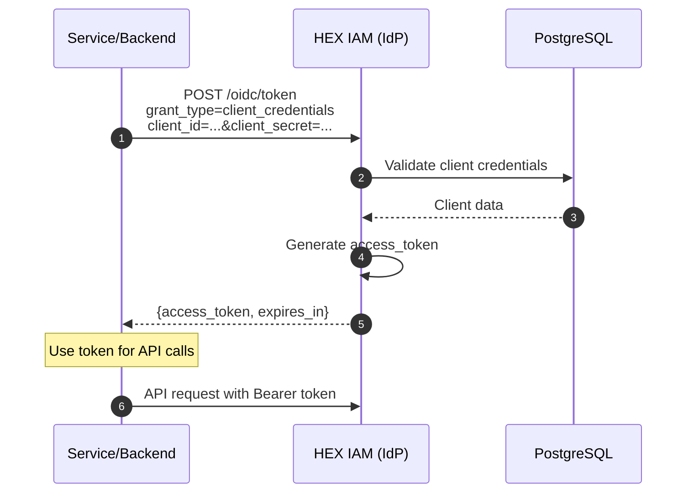
```mermaid
sequenceDiagram
    autonumber
    participant SVC as Service/Backend
    participant IdP as HEX IAM (IdP)
    participant DB as PostgreSQL

    SVC->>IdP: POST /oidc/token<br/>grant_type=client_credentials<br/>client_id=...&client_secret=...
    
    IdP->>DB: Validate client credentials
    DB-->>IdP: Client data
    
    IdP->>IdP: Generate access_token
    IdP-->>SVC: {access_token, expires_in}
    
    Note over SVC: Use token for API calls
    SVC->>IdP: API request with Bearer token
```

### OIDC Endpoints Overview

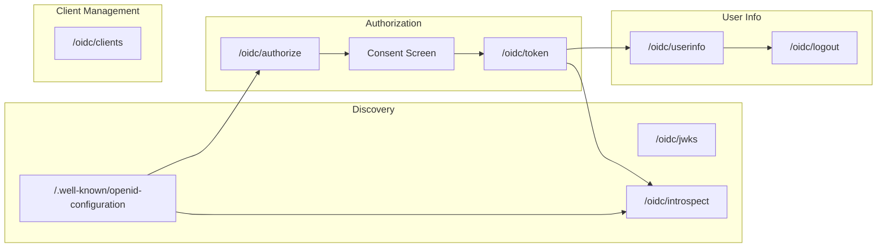
```mermaid
flowchart LR
    subgraph Discovery["Discovery"]
        DISC["/.well-known/openid-configuration"]
        JWKS["/oidc/jwks"]
        INTROSPECT["/oidc/introspect"]
    end
    
    subgraph Auth["Authorization"]
        AUTHZ["/oidc/authorize"]
        TOKEN["/oidc/token"]
        CONSENT["Consent Screen"]
    end
    
    subgraph User["User Info"]
        USERINFO["/oidc/userinfo"]
        LOGOUT["/oidc/logout"]
    end
    
    subgraph Admin["Client Management"]
        CLIENTS["/oidc/clients"]
    end
    
    DISC --> AUTHZ
    DISC --> INTROSPECT
    AUTHZ --> CONSENT
    CONSENT --> TOKEN
    TOKEN --> USERINFO
    TOKEN --> INTROSPECT
    USERINFO --> LOGOUT
```

### OIDC token verification and key lifecycle

```mermaid
flowchart TD
    CFG[Configured ALGORITHM] --> MODE{Symmetric or Asymmetric}
    MODE -->|HS256| HS[JWT_SECRET signing/verification]
    MODE -->|RS256 or ES256| SKM[SigningKeyManager]
    SKM --> KS[Persistent keyset: .runtime/jwks.json]
    SKM --> JWKS_EP[/oidc/jwks]
    SKM --> ROT[Background rotation task]
    ROT --> RET[Retention pruning]
    TOK[/oidc/token] --> SIGN[Token signing]
    SIGN --> HS
    SIGN --> SKM
    INT[/oidc/introspect] --> DEC[Token decode + validation]
    DEC --> HS
    DEC --> SKM
    INT --> REV[Revocation check (Bloom filter)]
```
## System boundary

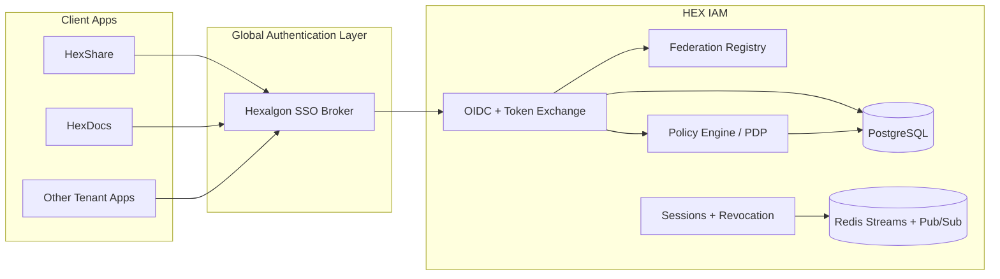
```mermaid
flowchart LR
    subgraph GlobalAuth[Global Authentication Layer]
        SSO[Hexalgon SSO Broker]
    end

    subgraph TenantIAM[HEX IAM]
        OIDC[OIDC + Token Exchange]
        FED[Federation Registry]
        AUTHZ[Policy Engine / PDP]
        SESS[Sessions + Revocation]
        DB[(PostgreSQL)]
        REDIS[(Redis Streams + Pub/Sub)]
    end

    subgraph Apps[Client Apps]
        A1[HexShare]
        A2[HexDocs]
        A3[Other Tenant Apps]
    end

    A1 & A2 & A3 --> SSO
    SSO --> OIDC
    OIDC --> FED
    OIDC --> AUTHZ
    OIDC --> DB
    AUTHZ --> DB
    SESS --> REDIS
```

## Responsibility split

### Stays in IAM

- tenant users
- tenant roles and policy templates
- app-scoped token issuance
- authorization checks and PDP mode
- local/native IAM login
- session management and revocation

### Moves to SSO

- global user identity
- cross-app shared login session
- platform identity token issuance
- federation to upstream providers

## Broker-ready IAM sequence

```mermaid
sequenceDiagram
    autonumber
    actor User
    participant App as Client App
    participant SSO as Hexalgon SSO
    participant IAM as HEX IAM
    participant DB as PostgreSQL

    User->>App: Open protected route
    App->>SSO: /authorize?client_id=app-client
    SSO->>SSO: Authenticate or reuse global session
    SSO->>App: Redirect with code
    App->>SSO: /token (authorization_code + PKCE)
    SSO->>App: Platform identity token
    App->>IAM: /api/v1/oidc/token (token-exchange)
    IAM->>DB: Resolve trusted provider by issuer + tenant
    IAM->>DB: Find or create tenant-local linked user
    IAM->>DB: Load policies for local user
    IAM->>App: tenant-scoped token (aud=app-client, policy embedded)
```

## Federation-aware IAM internals

```mermaid
flowchart TD
    T[subject_token from broker] --> U[Read unverified iss]
    U --> P[Find enabled identity_provider for tenant]
    P --> V{Validation mode}
    V -->|jwks_uri/discovery| J[Verify JWT via JWKS]
    V -->|jwt_validation_secret| S[Verify JWT via shared secret]
    J --> C[Extract claims]
    S --> C
    C --> L{Existing federated link?}
    L -->|Yes| E[Load local user]
    L -->|No| A{auto_link?}
    A -->|Yes| M[Find local user by email or create one]
    M --> X[Insert federated link]
    A -->|No| R[Reject exchange]
    E --> O[Issue IAM access token]
    X --> O
```

## New federation boundary
Downstream apps still talk only to HEX IAM.

When no local IAM session exists, IAM can now:
1. resolve tenant from downstream `client_id`
2. choose native login or an enabled upstream OIDC provider
3. redirect the browser upstream
4. exchange the upstream code on callback
5. resolve or provision a tenant-local user
6. create a local IAM session
7. continue the normal consent/code/token flow

Additional browser-federation behavior:

- if exactly one enabled upstream provider exists, IAM redirects upstream automatically
- if multiple enabled upstream providers exist, IAM renders a provider chooser page
- `local_login=1` forces native IAM login even when upstream providers are configured
- on successful upstream callback, IAM creates a normal local `hex_iam_session` before resuming consent/code issuance

## Trust split
- upstream SSO proves identity
- HEX IAM decides tenant membership, role, and policy
- app consumes the final IAM token

Tenant-scoped linking note:

- local user linking and provisioning are always performed in the tenant resolved from the downstream client flow
- the same email address may exist in multiple tenants without conflict
- the same upstream identity may therefore link separately to different tenant-local users


## Token model

The final token handed to apps remains app-scoped:

```json
{
  "sub": "user@example.com",
  "tenant_id": "tenant-123",
  "aud": "client-app-id",
  "role": "admin",
  "policy": {"documents": 3, "reports": 1}
}
```

This is intentional. The shared thing across apps is the SSO session, not a giant tenant-wide access token.

---

## How to View Diagrams

1. Copy any mermaid code block
2. Go to [mermaid.live](https://mermaid.live)
3. Paste the code in the editor
4. View/export the rendered diagram

Or use VS Code with the "Markdown Preview Mermaid Support" extension.
