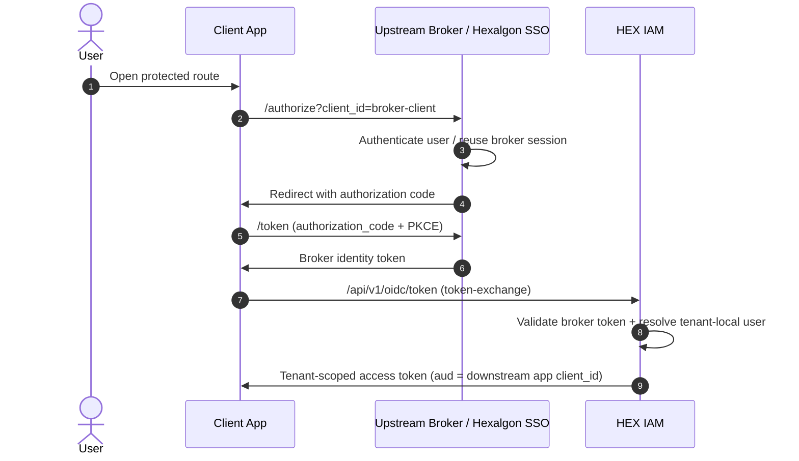
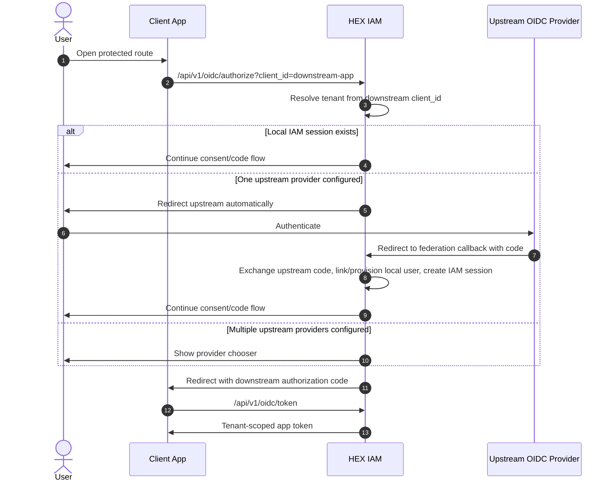
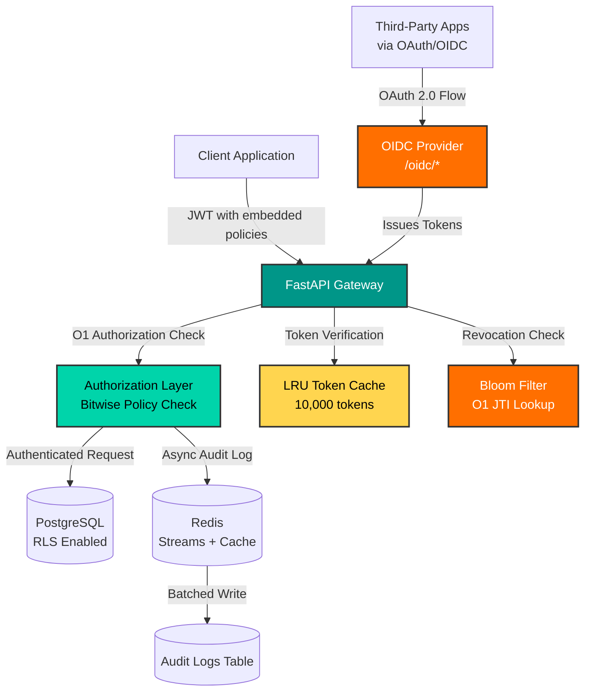

# HEX IAM - Policy-Embedded Identity & Access Management System

[](https://opensource.org/licenses/Apache-2.0)
[](https://www.python.org/downloads/)
[](https://fastapi.tiangolo.com)
[](https://www.docker.com/)
[](CONTRIBUTING.md)
[](https://github.com/Merrick1307/identity-access-management-system)
[](https://openid.net/connect/)

A high-performance, multi-tenant Identity and Access Management (IAM) system built with FastAPI, featuring **policy-embedded JWT tokens** for O(1) authorization, fine-grained access control, and Redis-backed audit logging.

> **Why HEX IAM?** Unlike traditional IAM systems that require a round-trip to check permissions, HEX IAM embeds compact user policies directly in JWT tokens, enabling instant authorization decisions at the edge.

## Why HEX IAM?

| Feature | HEX IAM | Traditional IAM |
|---------|---------|-----------------|
| Authorization Latency | **O(1)** - Policy in token | O(n) - Database lookup |
| Multi-tenancy | Native RLS isolation | Manual filtering |
| Token Revocation | Bloom filter (0.0001% FP) | Database queries |
| Audit Logging | Async Redis Streams | Blocking DB writes |
| Policy Format | Bitwise compact | Verbose JSON |

## Documentation

- [**API Reference**](./API_REFERENCE.md) - Complete REST API documentation
- [**Architecture**](./ARCHITECTURE.md) - System design with diagrams
- [**BEAMS Example**](https://github.com/Merrick1307/bank-employees-access-management-system) - Reference IGA application built with HEX IAM

## Quick Example
```bash
# Login (service accounts authentication)
curl -X POST http://localhost:8000/api/v1/authenticate/token \
  -H "X-TENANT-ID: your-tenant-id" \
  -H "Content-Type: application/json" \
  -d '{"email": "admin@acme.com", "password": "SecurePass123!"}'

# Check permission (instant - no DB lookup!)
curl -X POST http://localhost:8000/api/v1/authorize/authorize \
  -H "Authorization: Bearer <token>" \
  -d '{"action": "read", "resource": "documents"}'
# Response: true (in <1ms)
```

## Features

- **Multi-Tenant Architecture** - PostgreSQL Row-Level Security (RLS) for tenant isolation
- **Policy-Embedded JWT** - User policies embedded in tokens for O(1) authorization checks
- **Fine-Grained Access Control** - Bitwise permission system with 12 action types
- **High-Performance Responses** - `orjson` serialization
- **Async Audit Logging** - Redis Streams with batched writes, zero request blocking
- **Token Revocation** - Bloom filter for O(1) JTI lookups
- **LRU Token Cache** - 10,000 token cache for repeated verifications
- **OAuth 2.0 / OIDC Identity Provider** - Full SSO support with PKCE

---

## SSO & Identity Provider

HEX IAM includes a **complete OAuth 2.0 / OpenID Connect Identity Provider**, allowing you to use it as the authentication backend for your applications.

### OAuth 2.0 Flows Supported

- **Authorization Code Flow** (with PKCE)
- **Client Credentials Flow** (service-to-service)
- **Refresh Token Flow**

### OIDC Endpoints

| Endpoint | Description |
|----------|-------------|
| `/api/v1/.well-known/openid-configuration` | OpenID Discovery document |
| `/api/v1/oidc/jwks` | JSON Web Key Set |
| `/api/v1/oidc/authorize` | Authorization endpoint |
| `/api/v1/oidc/token` | Token endpoint |
| `/api/v1/oidc/userinfo` | User info endpoint |
| `/api/v1/oidc/logout` | End session endpoint |
| `/api/v1/oidc/clients` | Client management (CRUD) |

### Broker-ready federation

HEX IAM now includes:

- `identity_providers` table for tenant-trusted external brokers / IdPs
- `federated_identities` table for local user linking
- `/api/v1/federation/providers*` admin APIs
- `urn:ietf:params:oauth:grant-type:token-exchange` support on `/api/v1/oidc/token`

### What stays the same

- tenant-owned OIDC clients
- local/native IAM login remains supported
- app-scoped access tokens remain the end state
- authorization stays inside IAM

## High-level federation flows

HEX IAM now supports **two distinct federation patterns**.

### 1. Broker token exchange flow

Use this when the application authenticates users against an upstream broker directly, then exchanges the broker token for a tenant-scoped IAM token.



### 2. Browser Initiated upstream federation via IAM

Use this when the application integrates only with HEX IAM and IAM decides whether to use local login or redirect to a tenant-trusted upstream IdP.



#### Compatibility note

HEX IAM currently supports Hexalgon SSO and other OIDC-compatible upstream identity providers.

SAML is not implemented yet, even though the provider model already reserves a protocol field for it.

## New API surface

### Federation admin

- `GET /api/v1/federation/providers`
- `POST /api/v1/federation/providers`
- `GET /api/v1/federation/providers/{provider_id}`
- `PATCH /api/v1/federation/providers/{provider_id}`
- `DELETE /api/v1/federation/providers/{provider_id}`
- `GET /api/v1/federation/providers/{provider_id}/links`

### OIDC token exchange

`POST /api/v1/oidc/token`

```x-www-form-urlencoded
client_id=<tenant_app_client_id>
client_secret=<tenant_app_client_secret>
grant_type=urn:ietf:params:oauth:grant-type:token-exchange
subject_token=<broker_platform_token>
audience=<tenant_app_client_id>
issuer_hint=https://sso.hexalgon.local
```

## Data model additions

### `identity_providers`

A tenant-local registry of trusted brokers / IdPs.

Key fields:

- `tenant_id`
- `protocol`
- `issuer_url`
- `discovery_url`
- `jwks_uri`
- `jwt_validation_secret` (bootstrap/dev validation mode)
- `auto_link`

### `federated_identities`

Maps an external broker identity to a tenant-local user.

Key fields:

- `tenant_id`
- `provider_id`
- `user_id`
- `external_subject`
- `external_email`

## Notes on validation modes

This implementation supports two practical validation paths for broker tokens:

1. **JWKS / discovery mode** - for RS256/ES256 style providers
2. **Shared secret mode** using `jwt_validation_secret` - useful for local development and initial bootstrap with the companion SSO repo scaffold

## Notes on tenant-scoped linking

Federated user linking is **tenant-scoped**.

That means the same email address may exist in multiple tenants, and HEX IAM will only auto-link or provision **within the tenant resolved from the downstream app/client flow**.

Practical effect:
- the same upstream identity can be linked separately in Tenant A and Tenant B
- roles and policies remain tenant-local
- `auto_link=true` never causes cross-tenant user linking

## Companion repo

Use the **Hexalgon SSO** companion repo as the global broker. IAM trusts it through an `identity_providers` entry and exchanges its platform token for a tenant-scoped token.


## Upstream browser federation

HEX IAM can now initiate upstream OIDC federation directly from `/api/v1/oidc/authorize` when one or more tenant-trusted identity providers are configured.

Behavior:

- no local IAM session + one enabled provider -> redirect upstream automatically
- no local IAM session + multiple enabled providers -> show provider chooser
- `local_login=1` -> force native IAM login even when providers exist
- upstream callback -> IAM exchanges upstream code, links/provisions local user, sets `hex_iam_session`, then resumes at consent

HEX IAM is the tenant-aware identity and authorization layer in the Hexalgon stack.

It now supports two federation modes:
- token exchange from a trusted upstream broker token
- browser-initiated upstream OIDC federation from `/api/v1/oidc/authorize`

## Role in the stack
- App integrates with HEX IAM as its downstream OIDC provider
- Broker/SSO authenticates the user
- HEX IAM links or provisions the tenant-local user and issues the final tenant/app-scoped token

## Bring-your-own-IdP support
A tenant can configure one or more upstream OIDC identity providers and let IAM:
- redirect the browser to that provider
- handle the callback
- create a local IAM session
- resume consent/code issuance

## OIDC interop fields on identity providers
- `authorization_scopes`
- `token_endpoint_auth_method`
- `claims_source`
- `link_by_email_verified_only`
- `default_role`

These improve compatibility with standards-based upstream OIDC providers such as generic enterprise and social IdPs.


### Quick Integration Example

**Step 1: Register an OAuth Client**
```bash
curl -X POST http://localhost:8000/api/v1/oidc/clients \
  -H "Authorization: Bearer <admin-token>" \
  -H "X-TENANT-ID: your-tenant-id" \
  -H "Content-Type: application/json" \
  -d '{
    "name": "My Web App",
    "redirect_uris": ["https://myapp.com/callback"],
    "scopes": ["openid", "profile", "email"]
  }'
```
**OR Login via the admin dashboard available at either 5173 or 3000 port and register client apps seamlessly via the intuitive UI**

**Step 2: Authorization Flow**
```bash
# 1. Redirect user to authorization endpoint
https://hex-iam.example.com/api/v1/oidc/authorize?
  client_id=client_abc123...&
  redirect_uri=https://myapp.com/callback&
  response_type=code&
  scope=openid%20profile%20email&
  state=random_state_string&
  code_challenge=BASE64URL(SHA256(code_verifier))&
  code_challenge_method=S256

# 2. User logs in, approves consent
# 3. HEX IAM redirects back with authorization code
# 4. Exchange code for tokens
curl -X POST http://localhost:8000/api/v1/oidc/token \
  -H "Content-Type: application/x-www-form-urlencoded" \
  -d "grant_type=authorization_code" \
  -d "code=AUTH_CODE" \
  -d "redirect_uri=https://myapp.com/callback" \
  -d "client_id=client_abc123..." \
  -d "client_secret=secret_xyz..." \
  -d "code_verifier=ORIGINAL_CODE_VERIFIER"
```

**Response:**
```json
{
  "access_token": "eyJhbGciOiJIUzI1NiIs...",
  "token_type": "Bearer",
  "expires_in": 3600,
  "refresh_token": "eyJhbGciOiJIUzI1NiIs...",
  "id_token": "eyJhbGciOiJIUzI1NiIs..."
}
```

**Step 3: Get User Info**
```bash
curl http://localhost:8000/api/v1/oidc/userinfo \
  -H "Authorization: Bearer <access_token>"
```

### Supported Features

- **PKCE (RFC 7636)** - Secure public clients without secrets
- **Consent Screen** - User-friendly permission approval UI
- **Client Management** - Full CRUD for OAuth clients
- **Scope-based Access** - `openid`, `profile`, `email` scopes
- **Discovery Document** - Standard OIDC auto-configuration

<details>
<summary><b>Python Integration (using Authlib)</b></summary>

```python
from authlib.integrations.requests_client import OAuth2Session

client = OAuth2Session(
    client_id='your-client-id',
    client_secret='your-client-secret',
    redirect_uri='https://myapp.com/callback',
    scope='openid profile email'
)

# Get authorization URL
authorization_url, state = client.create_authorization_url(
    'https://hex-iam.example.com/api/v1/oidc/authorize'
)

# After user authorizes, exchange code for token
token = client.fetch_token(
    'https://hex-iam.example.com/api/v1/oidc/token',
    authorization_response=callback_url
)

# Get user info
userinfo = client.get('https://hex-iam.example.com/api/v1/oidc/userinfo').json()
```

</details>

<details>
<summary><b>Node.js Integration (using Passport)</b></summary>

```javascript
const passport = require('passport');
const OpenIDConnectStrategy = require('passport-openidconnect').Strategy;

passport.use(new OpenIDConnectStrategy({
    issuer: 'https://hex-iam.example.com',
    authorizationURL: 'https://hex-iam.example.com/api/v1/oidc/authorize',
    tokenURL: 'https://hex-iam.example.com/api/v1/oidc/token',
    userInfoURL: 'https://hex-iam.example.com/api/v1/oidc/userinfo',
    clientID: 'your-client-id',
    clientSecret: 'your-client-secret',
    callbackURL: 'https://myapp.com/callback',
    scope: ['openid', 'profile', 'email']
  },
  function(issuer, profile, done) {
    return done(null, profile);
  }
));
```

</details>

See [ARCHITECTURE.md](ARCHITECTURE.md#oauth-20--oidc-identity-provider-flow) for detailed flow diagrams.

---

## Tech Stack

| Component | Technology |
|-----------|------------|
| Framework | FastAPI 0.100+ |
| Database | PostgreSQL 15+ with asyncpg |
| Cache/Queue | Redis 7+ with redis-py async |
| Auth | PyJWT, bcrypt, OAuth 2.0/OIDC |
| Serialization | orjson |
| Token Revocation | rbloom (Bloom filter) |


## Architecture


**Key Features:**
-  **O(1) Authorization** - Policies embedded in JWT tokens
-  **Multi-tenant RLS** - PostgreSQL Row-Level Security
-  **Built-in OAuth/OIDC** - Complete Identity Provider
-  **Async Audit Logs** - Redis Streams with batched writes
-  **Token Revocation** - Bloom filter for instant checks
-  **LRU Cache** - 10,000 token verification cache

See [ARCHITECTURE.md](ARCHITECTURE.md) for detailed system design and data flow diagrams.

---

## Quick Start

### Prerequisites

- Python 3.12+
- PostgreSQL 15+
- Redis 7+
- **OR** Docker & Docker Compose (recommended for quick start)

### Option 1: Docker Compose (Recommended)

The fastest way to get the full local development stack running:
```bash
# Clone repository
git clone https://github.com/Merrick1307/identity-access-management-system.git
cd hex-iam

# Copy and configure environment
cp .env.example .env
# Edit .env with your credentials (see Environment Variables below)

# Start all services
docker compose -f docker-compose.dev.yaml up -d

# View logs
docker compose -f docker-compose.dev.yaml logs -f hex-iam

# Stop services
docker compose -f docker-compose.dev.yaml down
```

**Services started:**
- `hex-iam` - Main API server (port 8000)
- `postgres` - PostgreSQL database (port 5432)
- `redis` - Redis cache/queue (port 6379)
- `admin-portal` - Admin UI (port 3000)

**API will be available at:** `http://localhost:8000`

**Swagger docs at:** `http://localhost:8000/docs`

### Production-style Compose

The default [docker-compose.yaml](./docker-compose.yaml) is now a hardened deployment profile:

- loads runtime variables from `/etc/environment`
- binds HEX IAM to `127.0.0.1:8000`
- keeps PostgreSQL and Redis on the internal Docker network only
- drops Linux capabilities and enables `no-new-privileges` for the IAM container

Example:
```bash
docker compose up -d
docker compose logs -f hex-iam
```

If your environment file lives elsewhere, set `HOST_ENV_FILE=/path/to/environment` when invoking Compose.

Run it behind a reverse proxy or load balancer that terminates TLS and forwards traffic to `127.0.0.1:8000`.

### Option 2: Manual Installation

```bash
# Clone repository
git clone https://github.com/Merrick1307/identity-access-management-system.git
cd hex-iam

# Install dependencies
pip install poetry
poetry install

# Configure environment
cp .env.example .env
# Edit .env with your database credentials
```

### Environment Variables

```env
DATABASE_USER= # PostgreSQL username
DATABASE_PASSWORD= # PostgreSQL password
DATABASE_URL= # PostgreSQL connection string (e.g., localhost:5432/dbname)
DATABASE_NAME= # PostgreSQL database name (for initial DB setup)

REDIS_HOST=
REDIS_PORT=
REDIS_USER=
REDIS_PASSWORD=
REDIS_DB= # Redis database index (default: 0)
# Hashing and encryption
JWT_SECRET= # Secret key for JWT signing and authentication
ALGORITHM= # JWT algorithm
ENCRYPT_KEY= # Secret key for encrypting sensitive data
APP_NAME= # Application name
APP_BASE_URL= # Application base URL

# Email Configuration (optional)
MAIL_USERNAME=
MAIL_PASSWORD=
MAIL_FROM= # Email sender address
MAIL_PORT= # Email server port
MAIL_SERVER=
#Note: use only one of them below (either should be set to 1 and other to 0)
MAIL_SSL_TLS= # whether to use SSL/TLS
MAIL_STARTTLS= # whether to use STARTTLS Note: use only one of them
```

### Redis ACL note

HEX IAM now uses both:

- **Redis Streams** for durable audit/revocation replay
- **Redis Pub/Sub** for immediate cross-node revocation fan-out

Because of that, the Redis ACL user must have **channel permissions** in addition to key permissions.

Example ACL entry:

```txt
user hex-iam on >your-password allcommands allkeys allchannels
```

A user with only allkeys but no channel permissions will be able to use Streams but will fail with:

No permissions to access a channel

### Run

```bash
# Development
poetry run uvicorn app.main:app --reload

# Production
poetry run uvicorn app.main:app --host 0.0.0.0 --port 8000 --workers 4
```

---

## API Reference

Base URL: `http://localhost:8000/api/v1`

### Authentication

#### Login - Get Access Token

```http
POST /api/v1/authenticate/token
```

**Headers:**
```
X-TENANT-ID: your-tenant-uuid
Content-Type: application/json
```

**Request Body:**
```json
{
  "email": "user@example.com",
  "password": "securepassword123"
}
```

**Response (200 OK):**
```json
{
  "success": true,
  "data": {
    "access_token": "eyJhbGciOiJIUzI1NiIs...",
    "token_type": "Bearer"
  },
  "message": "Authentication successful",
  "timestamp": "2024-12-05T00:00:00.000000+00:00"
}
```

#### Logout - Revoke Token

```http
POST /api/v1/authenticate/logout
```

**Headers:**
```
Authorization: Bearer <access_token>
```

**Response (200 OK):**
```json
{
  "success": true,
  "message": "Logged out successfully",
  "timestamp": "2024-12-05T00:00:00.000000+00:00"
}
```

#### Refresh Token

```http
GET /api/v1/authenticate/refresh
```

**Headers:**
```
Authorization: Bearer <access_token>
```

**Response (200 OK):**
```json
{
  "success": true,
  "data": {
    "access_token": "eyJhbGciOiJIUzI1NiIs...",
    "refresh_token": "eyJhbGciOiJIUzI1NiIs..."
  },
  "message": "Token refreshed successfully",
  "timestamp": "2024-12-05T00:00:00.000000+00:00"
}
```

---

### Session Management

#### List Active Sessions

```http
GET /api/v1/authenticate/sessions
```

**Headers:**
```
Authorization: Bearer <access_token>
```

**Response (200 OK):**
```json
{
  "success": true,
  "data": [
    {
      "jti": "user123-1701734400000000000",
      "device_info": {"user_agent": "Mozilla/5.0..."},
      "ip_address": "192.168.1.1",
      "created_at": "2024-12-05T00:00:00+00:00",
      "expires_at": "2024-12-05T01:00:00+00:00"
    }
  ],
  "message": "Found 1 active sessions",
  "timestamp": "2024-12-05T00:00:00.000000+00:00"
}
```

#### Logout All Sessions (Bulk Revocation)

```http
POST /api/v1/authenticate/logout-all
```

Revokes ALL active sessions for the current user - JTIs are added to Bloom filter.

**Response (200 OK):**
```json
{
  "success": true,
  "data": {"revoked_count": 5},
  "message": "Revoked 5 sessions",
  "timestamp": "2024-12-05T00:00:00.000000+00:00"
}
```

#### Logout Other Sessions

```http
POST /api/v1/authenticate/logout-others
```

Revokes all sessions except the current one.

**Response (200 OK):**
```json
{
  "success": true,
  "data": {"revoked_count": 4},
  "message": "Revoked 4 other sessions",
  "timestamp": "2024-12-05T00:00:00.000000+00:00"
}
```

#### Revoke Specific Session

```http
DELETE /api/v1/authenticate/sessions/{jti}
```

**Response:** `204 No Content`

---

### Authorization

#### Check Permission

```http
POST /api/v1/authorize/authorize
```

**Headers:**
```
Authorization: Bearer <access_token>
Content-Type: application/json
```

**Request Body:**
```json
{
  "action": "read",
  "resource": "documents",
  "grant_type": "fga",
  "check_condition": false
}
```

**Parameters:**
| Field | Type | Required | Description |
|-------|------|----------|-------------|
| action | string | Yes | Permission action (read, write, delete, etc.) |
| resource | string | Yes | Resource identifier |
| grant_type | string | No | `fga` (fine-grained) or `rba` (role-based). Default: `fga` |
| check_condition | bool | No | Whether to evaluate policy conditions |
| conditions_to_check | object | Conditional | Required if `check_condition` is true |

**Available Actions:**
```
read, write, delete, approve, reject, execute, 
assign, manage, export, import, activate, archive
```

**Response (200 OK):**
```json
true   // or false
```

---

### Onboarding

#### Create New Tenant

```http
POST /api/v1/onboarding/tenant/
```

**Request Body:**
```json
{
  "tenant": {
    "name": "Acme Corporation",
    "domain": "acme.com",
    "root": "admin@acme.com"
  },
  "user": {
    "email": "admin@acme.com",
    "password": "SecurePass123!",
    "first_name": "John",
    "last_name": "Doe",
    "role": "root"
  },
  "tenant_policies": [
    {
      "policy_id": "custom_policy",
      "policy": {
        "resource": "reports",
        "actions": ["read", "export"],
        "conditions": {}
      }
    }
  ]
}
```

**Response (201 Created):**
```json
{
  "success": true,
  "data": {
    "tenant_id": "550e8400-e29b-41d4-a716-446655440000",
    "user_id": "550e8400-e29b-41d4-a716-446655440001",
    "tenant_name": "Acme Corporation",
    "admin_email": "admin@acme.com",
    "verification_email_sent": true,
    "message": "Successfully created new tenant - root: admin@acme.com"
  },
  "timestamp": "2024-12-05T00:00:00.000000+00:00"
}
```

#### Verify Email

```http
GET /api/v1/onboarding/email/verify?token=<jwt_token>
```

**Response (200 OK):**
```json
{
  "message": "Email verified successfully. You can now log in."
}
```

---

### Policy Management

#### Get My Policies

```http
GET /api/v1/policies/me
```

**Headers:**
```
Authorization: Bearer <access_token>
```

**Response (200 OK):**
```json
{
  "success": true,
  "data": [
    {
      "policy_id": "admin_access",
      "user_id": "uuid",
      "tenant_id": "uuid",
      "resource": "all",
      "actions": ["manage", "write", "delete"],
      "conditions": null,
      "created_at": "2024-12-05T00:00:00+00:00"
    }
  ],
  "message": "Retrieved 1 policies",
  "timestamp": "2024-12-05T00:00:00.000000+00:00"
}
```

#### Get User Policies (Admin)

```http
GET /api/v1/policies/user/{user_id}
```

#### Create Policy for User

```http
POST /api/v1/policies/user/{user_id}
```

**Request Body:**
```json
{
  "policy_id": "reports_readonly",
  "resource": "reports",
  "actions": ["read", "export"],
  "conditions": {
    "department": "finance"
  }
}
```

**Response (201 Created):**
```json
{
  "success": true,
  "data": {
    "policy_id": "reports_readonly",
    "user_id": "uuid",
    "tenant_id": "uuid",
    "resource": "reports",
    "actions": ["read", "export"],
    "conditions": {"department": "finance"},
    "created_at": "2024-12-05T00:00:00+00:00"
  },
  "message": "Policy 'reports_readonly' created successfully",
  "timestamp": "2024-12-05T00:00:00.000000+00:00"
}
```

#### Update Policy

```http
PUT /api/v1/policies/user/{user_id}/{policy_id}
```

**Request Body:**
```json
{
  "actions": ["read", "write", "export"],
  "conditions": {
    "department": "finance",
    "level": "senior"
  }
}
```

#### Delete Policy

```http
DELETE /api/v1/policies/user/{user_id}/{policy_id}
```

**Response:** `204 No Content`

#### Bulk Assign Policy

```http
POST /api/v1/policies/bulk-assign
```

**Request Body:**
```json
{
  "user_ids": ["uuid1", "uuid2", "uuid3"],
  "policy_id": "viewer_policy",
  "resource": "documents",
  "actions": ["read"],
  "conditions": {}
}
```

**Response (201 Created):**
```json
{
  "success": true,
  "data": {
    "assigned_count": 3,
    "policy_id": "viewer_policy",
    "user_ids": ["uuid1", "uuid2", "uuid3"]
  },
  "message": "Policy assigned to 3 users",
  "timestamp": "2024-12-05T00:00:00.000000+00:00"
}
```

#### Revoke Policy

```http
DELETE /api/v1/policies/revoke/{user_id}/{policy_id}
```

#### List All Tenant Policies (Paginated)

```http
GET /api/v1/policies/tenant?page=1&page_size=20
```

---

## Policy Structure

Policies are embedded in JWT tokens for zero-latency authorization checks.

### Policy Format

```json
{
  "resource": "documents",
  "actions": ["read", "write", "delete"],
  "conditions": {
    "department": "engineering",
    "validity_time": {
      "start": "2024-01-01T00:00:00Z",
      "end": "2024-12-31T23:59:59Z"
    }
  }
}
```

### JWT Token Payload

```json
{
  "sub": "user@example.com",
  "user_id": "uuid",
  "tenant_id": "uuid",
  "role": "admin",
  "policy": {
    "documents": 7,      // READ | WRITE | DELETE = 1 + 2 + 4 = 7
    "reports": 257,      // READ | EXPORT = 1 + 256 = 257
    "all": 255           // Full admin access
  },
  "exp": 1701734400,
  "iat": 1701730800
}
```

### Bitwise Permission Values

| Action | Value | Binary |
|--------|-------|--------|
| READ | 1 | 0000 0000 0001 |
| WRITE | 2 | 0000 0000 0010 |
| DELETE | 4 | 0000 0000 0100 |
| APPROVE | 8 | 0000 0000 1000 |
| REJECT | 16 | 0000 0001 0000 |
| EXECUTE | 32 | 0000 0010 0000 |
| ASSIGN | 64 | 0000 0100 0000 |
| MANAGE | 128 | 0000 1000 0000 |
| EXPORT | 256 | 0001 0000 0000 |
| IMPORT | 512 | 0010 0000 0000 |
| ACTIVATE | 1024 | 0100 0000 0000 |
| ARCHIVE | 2048 | 1000 0000 0000 |

---

## Error Responses

All errors follow this standardized format:

```json
{
  "success": false,
  "error": {
    "code": "UNAUTHORIZED",
    "message": "Token has expired",
    "path": "/api/v1/authorize/authorize",
    "method": "POST"
  },
  "timestamp": "2024-12-05T00:00:00.000000+00:00"
}
```

### Error Codes

| Code | HTTP Status | Description |
|------|-------------|-------------|
| `UNAUTHORIZED` | 401 | Authentication required or failed |
| `FORBIDDEN` | 403 | Insufficient permissions |
| `NOT_FOUND` | 404 | Resource not found |
| `VALIDATION_ERROR` | 422 | Invalid request data |
| `DB_CONNECTION_ERROR` | 503 | Database unavailable |
| `INTERNAL_ERROR` | 500 | Unexpected server error |

---

## Database Schema

### Core Tables

- `tenants` - Organization accounts
- `users` - User accounts with tenant association
- `user_policies` - Per-user policy assignments
- `tenant_policies` - Tenant-wide policy templates
- `audit_logs` - Audit trail (populated from Redis)

### Row-Level Security

All tables use PostgreSQL RLS for automatic tenant isolation:

```sql
-- Set tenant context per request
SELECT set_config('app.tenant_id', 'tenant-uuid', true);

-- RLS policy automatically filters
SELECT * FROM users;  -- Only returns current tenant's users
```

---

## Performance


### Optimizations

1. **LRU Token Cache** - 10,000 tokens cached in memory
2. **Bloom Filter** - O(1) revocation check, 0.0001% false positive rate
3. **Redis Streams** - Batched audit writes every 5 seconds
4. **orjson** - 10x faster JSON serialization
5. **asyncpg** - Native PostgreSQL async driver with prepared statements
6. **Externalized SQL** - All queries in `.sql` files for maintainability

---

## Project Structure

```
app/
├── api/
│   └── v1/
│       ├── auth.py          # /authenticate endpoints
│       ├── authz.py         # /authorize endpoints  
│       ├── onboarding.py    # /onboarding endpoints
│       ├── otp.py           # /otp MFA endpoints
│       ├── policies.py      # /policies CRUD endpoints
│       ├── tenants.py       # /tenants management
│       └── users.py         # /users management
├── audit_logs/
│   ├── redis_logger.py      # Redis Streams async logger
│   └── consumer.py          # Background log processor
├── core/
│   ├── auth.py              # Authentication logic
│   ├── authz.py             # Authorization logic (bitwise)
│   ├── jwt_utils.py         # JWT create/verify with LRU cache
│   ├── token_revocation.py  # Bloom filter revocation manager
│   ├── responses.py         # Standardized API responses
│   └── config.py            # Environment config
├── database/
│   ├── __init__.py          # DB pool, lifespan, RLS context
│   ├── migrations/          # Yoyo database migrations
│   └── queries/             # Externalized SQL queries (.sql files)
├── exceptions/              # Custom exception handlers
├── models/                  # Pydantic request/response models
├── services/
│   ├── onboarding.py        # Tenant onboarding service
│   ├── otp_service.py       # TOTP MFA service
│   └── policy_service.py    # Policy management service
├── sso/
│   └── oidc/                # OAuth 2.0 / OIDC Identity Provider
├── templates/
│   ├── oidc/                # OAuth consent/login pages
│   └── onboarding/          # Email templates (HTML)
└── main.py                  # FastAPI app entry
```


---

## Roadmap

**Release history:** see [`CHANGELOG.md`](./CHANGELOG.md)

> Note: version metadata in code and package files should be kept in sync with the changelog.

### v0.3.0 - Protocol Compliance
- [ ] **OAuth 2.1 Compliance** - Full RFC 9126 support
- [ ] **PKCE Enforcement** - Mandatory for public clients
- [ ] **Device Authorization Flow** - RFC 8628 for IoT/CLI
- [x] **Token Introspection** - RFC 7662 endpoint
- [x] **RSA/ES256 Support** - Asymmetric JWT signing (RS256, ES256)
- [x] **Key Rotation** - Automated JWKS key rotation
- [ ] **WebAuthn/Passkeys** - Passwordless authentication
- [ ] **Hardware Key Support** - FIDO2/U2F integration

### v0.4.0 - Developer Experience
- [ ] **CLI Tool** - `hex-iam` command-line management
- [ ] **SDK Libraries** - Python, JavaScript, Go clients
- [ ] **Terraform Provider** - Infrastructure as code
- [ ] **OpenAPI Enhancements** - SDK generation support

### v0.5.0 - Observability & Operations
- [ ] **Prometheus Metrics** - Request latency, auth success/failure rates
- [ ] **OpenTelemetry Tracing** - Distributed request tracing
- [ ] **Webhook Events** - Real-time event notifications
- [ ] **Health Check Endpoints** - Kubernetes-ready probes

### v1.0.0 - Production Ready
- [ ] **Comprehensive Test Suite** - >90% coverage
- [ ] **Performance Benchmarks** - Published latency numbers
- [ ] **Security Audit** - Third-party penetration testing
- [ ] **Production Hardening** - Rate limiting, DDoS protection

### Enterprise Features (Planned)
See [Enterprise Edition](#-enterprise-edition) for features available under commercial license.

---

## Contributing

We welcome contributions! Please see our contribution guidelines:

1. Fork the repository
2. Create a feature branch (`git checkout -b feature/amazing-feature`)
3. Commit changes (`git commit -m 'Add amazing feature'`)
4. Push to branch (`git push origin feature/amazing-feature`)
5. Open a Pull Request

---

## Getting Help

- **Documentation:** [Full Docs](./docs/)
- **Issues:** [GitHub Issues](https://github.com/Merrick1307/identity-access-management-system/issues)
- **Discussions:** [GitHub Discussions](https://github.com/Merrick1307/identity-access-management-system/discussions)
- **Security:** See [SECURITY.md](SECURITY.md) for reporting vulnerabilities

---

### Development Setup

```bash
# Run tests
pytest

```

---

## 🏢 Enterprise Edition

Need enterprise features? HEX IAM Enterprise(coming soon) will include:

- **SAML 2.0** - Enterprise SSO integration
- **SCIM Provisioning** - Automated user lifecycle management
- **Policy Engine - More complex policy evaluation scenarios**
- **Directory Sync** - LDAP/Active Directory integration
- **Advanced Audit** - Compliance reporting (SOX, HIPAA, GDPR)
- **Priority Support** - SLA-backed support
- **On-Premise Deployment** - Full data sovereignty

## 📧 Contact

- **Email:** [muhammedyusufoa@gmail.com](mailto:muhammedyusufoa@gmail.com)
- **LinkedIn:** [Muhammed Yusuf](https://www.linkedin.com/in/muhammed-yusuf-75a935365/)
- **GitHub:** [@Merrick1307](https://github.com/Merrick1307)

---

## License

This project is licensed under the Apache 2.0 License - see the [LICENSE](LICENSE) file for details.

---

## Acknowledgments

- Built with [FastAPI](https://fastapi.tiangolo.com/)
- Inspired by modern authorization patterns from Zanzibar/SpiceDB
- Policy engine design influenced by AWS IAM and OPA
