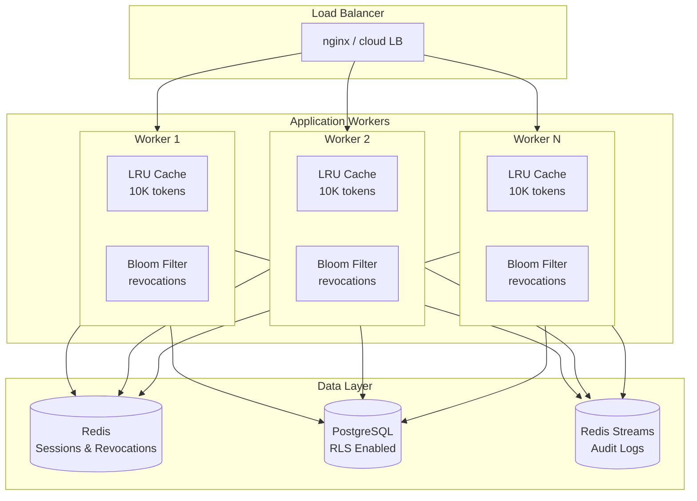
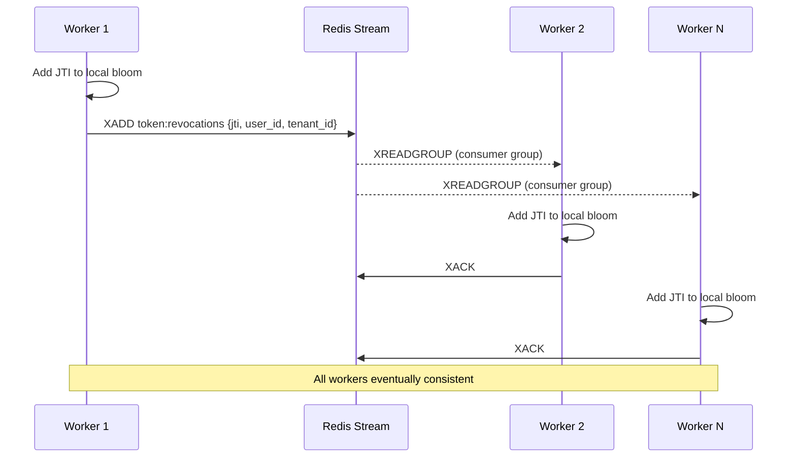
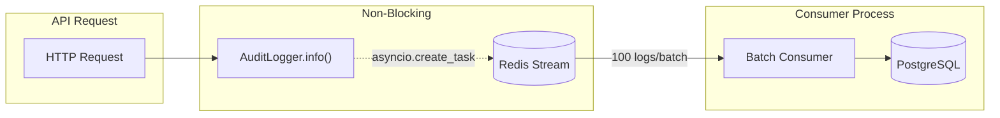

# Building Hexalgon IAM: A High-Performance Identity and Access Management System

*A deep dive into designing and implementing a modern, scalable IAM system with sub-millisecond authorization*

---

## Introduction

Identity and Access Management (IAM) is the backbone of modern application security. Every API call, every user action, every service-to-service communication needs to answer two fundamental questions: **Who are you?** (Authentication) and **What can you do?** (Authorization).

Hexalgon IAM is a multi-tenant identity platform designed from the ground up for performance, security, and developer experience. This article explores the architectural decisions, implementation patterns, and trade-offs involved in building a production-ready IAM system.

---

## The Challenge

Modern IAM systems face several competing requirements:

1. **Sub-millisecond authorization** - Every API request requires permission checks; latency is critical
2. **Multi-tenancy** - Single deployment serving multiple organizations with complete data isolation
3. **Horizontal scalability** - Must handle millions of requests across distributed workers
4. **Real-time revocation** - When a token is revoked, all workers must immediately reject it
5. **Flexible permissions** - Support for RBAC, ABAC, and fine-grained access control
6. **Standards compliance** - OAuth 2.0, OpenID Connect, JWT specifications

Let's explore how Hexalgon IAM addresses each of these challenges.

---

## Architecture Overview



---

## Component Deep Dive

### 1. Embedded Policy Authorization

**The Problem**: Traditional authorization checks require a database query or cache lookup per request. At 10,000 RPS, this creates significant latency and infrastructure load.

**The Solution**: Embed authorization policies directly in the JWT token.

```python
# Traditional approach: Check permissions on each request
async def check_permission(user_id: str, action: str, resource: str) -> bool:
    policies = await db.fetch("SELECT * FROM policies WHERE user_id = $1", user_id)
    # Parse policies and check...  ~5-50ms

# Hexalgon approach: Bitwise check from embedded policy
def check_permission_local(token_payload: dict, action: str, resource: str) -> bool:
    policy = token_payload.get("policy", {})
    permission_bits = policy.get(resource, 0)
    action_bit = Action[action.upper()].value
    return (permission_bits & action_bit) == action_bit  # ~0.001ms
```

**Token Payload Structure**:
```json
{
  "sub": "user@example.com",
  "user_id": "550e8400-e29b-41d4-a716-446655440000",
  "tenant_id": "123e4567-e89b-12d3-a456-426614174000",
  "role": "admin",
  "policy": {
    "documents": 7,
    "users": 255,
    "settings": 128
  },
  "exp": 1734567890,
  "iat": 1734564290
}

// JWT Header includes:
{
  "alg": "HS256",
  "typ": "JWT",
  "jti": "550e8400-e29b-41d4-a716-446655440000-1734564290000000000"
}
```

**Bitwise Permission Encoding**:
| Action   | Bit Value | Binary    |
|----------|-----------|-----------|
| READ     | 1         | 00000001  |
| WRITE    | 2         | 00000010  |
| DELETE   | 4         | 00000100  |
| APPROVE  | 8         | 00001000  |
| MANAGE   | 128       | 10000000  |

A permission value of `7` (binary: `00000111`) grants READ + WRITE + DELETE.

**Why This Works**:
- **O(1) performance**: Single bitwise AND operation
- **No network calls**: Everything in the token
- **Horizontally scalable**: No shared state for authorization
- **Cryptographically verified**: JWT signature ensures integrity

**Trade-off**: Policy changes don't take effect until token refresh. We mitigate this with short token TTLs (1 hour) and configurable "live authorization" mode for sensitive operations.

---

### 2. LRU Token Cache

Even JWT decoding and signature verification adds latency when processing millions of tokens. Hexalgon uses a bounded LRU (Least Recently Used) cache to store verified token payloads.

```python
from functools import lru_cache
from dataclasses import dataclass

@dataclass(frozen=True, slots=True)  # Immutable, memory-efficient
class VerifiedTokenData:
    email: str
    user_id: str
    tenant_id: str
    role: str
    policy: frozenset  # Hashable for caching
    exp: int
    jti: str

# Cache up to 10,000 verified tokens
@lru_cache(maxsize=10_000)
def get_cached_token_data(jti: str, token_hash: str) -> VerifiedTokenData:
    # Only called on cache miss
    return decode_and_verify(token_hash)
```

**Why LRU?**
- Fixed memory footprint (10K entries max)
- Most-recently-used tokens stay in cache
- Automatic eviction of old tokens
- Thread-safe in Python 3.9+

**Cache Key Design**: We use `jti` (JWT ID) as the primary key, falling back to token hash. This ensures:
- Same token always hits the same cache entry
- Revoked tokens (by JTI) can be invalidated

---

### 3. Bloom Filter Token Revocation

**The Problem**: Token revocation is easy in monolithic systems—just delete from database. In distributed systems, how do you instantly tell all workers that a token is revoked?

**Naive Solutions and Their Problems**:
- **Database check per request**: 5-50ms latency, doesn't scale
- **Redis check per request**: 1-5ms latency, Redis becomes bottleneck
- **Push to all workers**: Complex, eventual consistency issues

**The Hexalgon Solution**: Distributed Bloom Filters synchronized via Redis Streams.

```python
from rbloom import Bloom  # High-performance Bloom filter

class TokenRevocationManager:
    def __init__(self, redis_client, bloom_filter):
        self.redis = redis_client
        self.bloom = bloom_filter  # Local bloom filter per worker
    
    def is_revoked(self, jti: str) -> bool:
        """O(1) check with no network call."""
        return jti in self.bloom
    
    async def revoke_token(self, jti: str, user_id: str, tenant_id: str):
        # 1. Add to local bloom immediately
        self.bloom.add(jti)
        
        # 2. Publish to Redis Stream for other workers (and persistence)
        await self.redis.xadd("token:revocations", {
            "jti": jti,
            "user_id": user_id,
            "tenant_id": tenant_id,
            "reason": reason
        }, maxlen=1_000_000)  # Keep last 1M revocations
```

**How Bloom Filters Work**:
- Probabilistic data structure for set membership
- **False positives possible**: May say "revoked" when it's not (~1% rate)
- **False negatives impossible**: If it says "not revoked," it's definitely not
- **O(1) lookup**: Constant time regardless of set size
- **Space efficient**: 1M entries in ~1.2MB memory

**Synchronization via Redis Streams**:



**Persistence & Compliance**:
Redis Streams provide durability via AOF/RDB persistence, meeting compliance requirements:
- **SOC 2 / ISO 27001**: Session termination is immediate and auditable
- **HIPAA**: Access control with full audit trail
- **PCI-DSS**: Session management and timeout controls
- **NIST 800-63B**: Token revocation capability

On startup, workers load ALL revocations from the stream via `XRANGE`, ensuring no missed revocations even after restarts.

---

### 4. Multi-Tenancy with Row-Level Security

**The Problem**: Multiple organizations share the same database. How do you guarantee complete data isolation?

**The Solution**: PostgreSQL Row-Level Security (RLS) combined with application-level tenant context.

```sql
-- Enable RLS on users table
ALTER TABLE users ENABLE ROW LEVEL SECURITY;
ALTER TABLE users FORCE ROW LEVEL SECURITY;

-- Policy: Users can only see rows in their tenant
CREATE POLICY tenant_isolation ON users
    FOR ALL
    USING (tenant_id = current_setting('app.tenant_id', true));
```

**Application-Level Enforcement**:
```python
async def get_db_connection(request: Request):
    tenant_id = request.state.user.get("tenant_id")
    
    conn = await pool.acquire()
    # Set tenant context for RLS
    await conn.execute(
        f"SET app.tenant_id = '{tenant_id}'"
    )
    return conn
```

**Why RLS?**
- **Defense in depth**: Even if application code has bugs, database enforces isolation
- **Transparent**: Queries don't need WHERE clauses for tenant filtering
- **Auditable**: Policy is visible in database schema

---

### 5. Async Audit Logging with Redis Streams

**The Problem**: Audit logs are critical for compliance (SOX, HIPAA, GDPR) but shouldn't slow down requests.

**The Solution**: Fire-and-forget logging to Redis Streams with background PostgreSQL persistence.

```python
class AuditLogger:
    async def info(self, message: str, **kwargs):
        entry = self._build_log_entry("INFO", message, **kwargs)
        # Non-blocking publish to Redis Stream
        asyncio.create_task(self.buffer.publish(entry))
```

**Architecture**:



**Why This Pattern?**
- **Zero request latency impact**: Logging is async
- **Durability**: Redis Streams persist to disk
- **Batch efficiency**: 100x fewer database writes
- **Backpressure handling**: Stream has max length, auto-trims old entries

---

### 6. OAuth 2.0 / OpenID Connect Implementation

Hexalgon implements the full OIDC specification for SSO integration:

**Supported Flows**:
- Authorization Code Flow (web apps)
- Authorization Code + PKCE (mobile/SPA)
- Client Credentials (service-to-service)

**Key Endpoints**:
```
GET  /api/v1/oidc/authorize          # Authorization request
POST /api/v1/oidc/token              # Token exchange
GET  /api/v1/oidc/userinfo           # User profile
POST /api/v1/oidc/logout             # End session
GET  /api/v1/oidc/.well-known/openid-configuration  # Discovery
```

**Client Application Registration**:
```python
@dataclass
class OIDCClient:
    client_id: str
    client_secret: str
    redirect_uris: list[str]
    allowed_scopes: list[str]
    token_ttl: int
```

---

### 7. Tenant Configuration

Each tenant can customize their security settings via a flexible JSONB configuration:

```python
DEFAULT_SETTINGS = {
    "mfa": {
        "enabled": False,
        "required_for_admins": False,
        "methods": ["totp", "email"]
    },
    "tokens": {
        "access_token_ttl": 3600,      # 1 hour
        "refresh_token_ttl": 604800,   # 7 days
        "id_token_ttl": 3600
    },
    "password_policy": {
        "min_length": 8,
        "require_uppercase": True,
        "require_numbers": True,
        "max_age_days": 90,
        "prevent_reuse_count": 5
    },
    "session": {
        "max_concurrent_sessions": 5,
        "idle_timeout_minutes": 30
    },
    "security": {
        "lockout_threshold": 5,
        "lockout_duration_minutes": 15,
        "require_email_verification": True
    }
}
```

**Why JSONB?**
- **Flexible**: Add new settings without schema migrations
- **Queryable**: PostgreSQL can index and query JSON fields
- **Versioned**: Merge with defaults ensures backward compatibility

---

## Performance Optimizations

### 1. orjson for JSON Serialization

Standard library `json` is slow. We use `orjson` for 3-10x faster serialization:

```python
import orjson

class OrjsonResponse(JSONResponse):
    def render(self, content: Any) -> bytes:
        return orjson.dumps(
            content,
            option=orjson.OPT_SERIALIZE_NUMPY | orjson.OPT_UTC_Z
        )
```

### 2. Dataclasses with Slots

Memory-efficient response objects:

```python
@dataclass(slots=True)  # Saves ~40% memory
class APIResponse:
    success: bool = True
    data: Any = None
    message: Optional[str] = None
```

### 3. Connection Pooling

PostgreSQL and Redis connections are pooled to avoid connection overhead:

```python
# PostgreSQL pool
pool = await asyncpg.create_pool(
    dsn=DATABASE_URL,
    min_size=5,
    max_size=20,
    command_timeout=60
)

# Redis connection
redis_client = redis.from_url(REDIS_URL, encoding="utf-8")
```

### 4. Async All The Way

FastAPI + asyncpg + aioredis for non-blocking I/O:

```python
async def authenticate(email: str, password: str):
    # These run concurrently, not sequentially
    user, policies = await asyncio.gather(
        fetch_user(email),
        fetch_policies(email)
    )
```

---

## Security Considerations

### Password Storage
- bcrypt with cost factor 12
- Automatic rehashing on login if cost factor changes

### Token Security
- Short-lived access tokens (1 hour)
- Longer refresh tokens (7 days) with rotation
- JTI (JWT ID) for revocation tracking
- Signature verification on every request

### Rate Limiting
- Per-endpoint limits
- Account lockout after failed attempts
- Exponential backoff

### Input Validation
- Pydantic models for all request bodies
- Email normalization and validation
- SQL injection prevention via parameterized queries

---

## Deployment Architecture

```yaml
# docker-compose.yml (simplified)
services:
  hex-iam:
    image: hexalgon/iam:latest
    deploy:
      replicas: 4
    environment:
      - DATABASE_URL=postgresql://...
      - REDIS_URL=redis://...
    
  redis:
    image: redis:7-alpine
    volumes:
      - redis_data:/data
    
  postgres:
    image: postgres:15
    volumes:
      - pg_data:/var/lib/postgresql/data
    
  audit-consumer:
    image: hexalgon/iam:latest
    command: python -m app.audit_logs.consumer
    deploy:
      replicas: 2
```

---

## Lessons Learned

### 1. Embed What You Can
Putting authorization data in the token eliminates network round-trips. The trade-off (stale data until refresh) is acceptable for most use cases.

### 2. Bloom Filters Are Magic
For membership testing at scale, nothing beats a bloom filter. The 1% false positive rate is worth the O(1) performance.

### 3. RLS Is Your Safety Net
Application bugs happen. Row-Level Security ensures tenant isolation even when code fails.

### 4. Async Logging Saves Latency
Never block a request to write a log. Redis Streams provide the perfect buffer.

### 5. Profile Everything
We discovered that `json.loads()` was 20% of our CPU time. Switching to `orjson` was a trivial change with significant impact.

---

## Conclusion

Building a production IAM system requires balancing many concerns: performance vs. consistency, security vs. usability, simplicity vs. flexibility. 

Hexalgon IAM demonstrates that with careful architecture—embedded policies, bloom filter revocation, async logging, and row-level security—you can achieve sub-millisecond authorization while maintaining the security and compliance features enterprises demand.

The system is designed to handle millions of requests per day. Based on architectural design and similar systems, **estimated** performance targets are:

> **Note**: These are theoretical estimates based on the architecture. Formal benchmarks will be published once proper load testing infrastructure is available.

- **< 1ms** estimated authorization latency (bitwise check, no I/O)
- **< 10ms** estimated authentication latency (includes bcrypt + DB)
- **99.9%+** target uptime with proper infrastructure
- **Zero** cross-tenant data leaks (enforced by PostgreSQL RLS)

The code is designed for horizontal scaling—add more workers behind the load balancer, and throughput increases linearly.

---

## Further Reading

- [RFC 6749: OAuth 2.0](https://tools.ietf.org/html/rfc6749)
- [OpenID Connect Core](https://openid.net/specs/openid-connect-core-1_0.html)
- [Bloom Filters by Example](https://llimllib.github.io/bloomfilter-tutorial/)
- [PostgreSQL Row-Level Security](https://www.postgresql.org/docs/current/ddl-rowsecurity.html)

---

## Current Limitations & Future Work

### Known Limitations (v0.1.0)
- **HS256 only** - RSA/ES256 signing planned for v0.2.0
- **No built-in rate limiting** - Rely on reverse proxy (nginx, Cloudflare)
- **Single-region** - No built-in geo-replication support yet
- **Manual key rotation** - Automated JWKS rotation planned

### Planned Improvements
- WebAuthn/Passkeys for passwordless authentication
- OAuth 2.1 compliance with PKCE enforcement
- Prometheus metrics and OpenTelemetry tracing
- CLI tool and SDK libraries

See the [GitHub Roadmap](https://github.com/Merrick1307/identity-access-management-system) for the full development plan.

---

*Hexalgon IAM is open-source under Apache 2.0. Enterprise features available under commercial license.*

**Contact**: [muhammedyusufoa@gmail.com](mailto:muhammedyusufoa@gmail.com) | [GitHub](https://github.com/Merrick1307)
