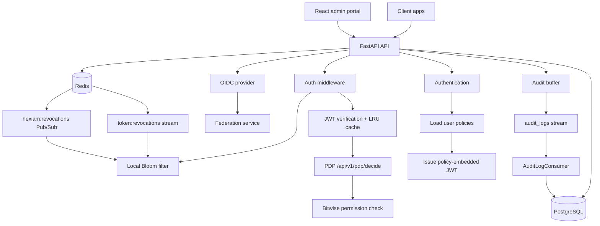
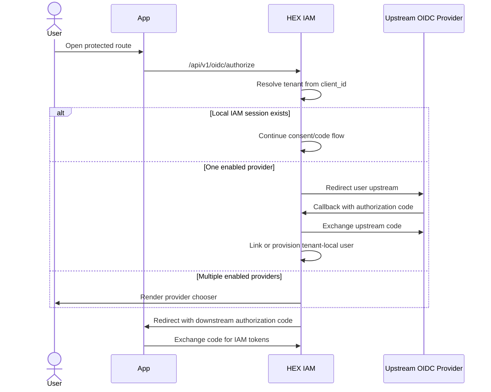

# Building HEX IAM v0.2.0: Policy-Embedded Identity and Access Management

**Subtitle:** How HEX IAM keeps common authorization checks local with policy-embedded JWTs, Bloom-filter revocation, PostgreSQL RLS, Redis-backed audit logs, OIDC, and upstream federation.

**Author:** Muhammed Yusuf
**Date:** April 2026
**Repository:** [github.com/Merrick1307/identity-access-management-system](https://github.com/Merrick1307/identity-access-management-system)
**Implementation version reviewed:** `0.2.0`

---

## Implementation Status

This article describes what is present in the current repository, not only the target architecture.

| Area | Current status |
| --- | --- |
| FastAPI backend | Implemented |
| React/Vite admin portal | Implemented |
| Policy-embedded JWTs | Implemented |
| Bitwise policy checks | Implemented |
| LRU token verification cache | Implemented |
| Bloom-filter revocation checks | Implemented |
| Redis Streams revocation replay | Implemented |
| Redis Pub/Sub revocation fan-out | Implemented |
| PostgreSQL RLS tenant isolation | Implemented for core tenant tables |
| Async audit logging through Redis Streams | Implemented |
| OIDC Authorization Code, Refresh Token, Client Credentials | Implemented |
| OIDC token exchange | Implemented but not advertised in discovery yet |
| Browser-initiated upstream OIDC federation | Implemented |
| SAML providers | Reserved in model, not implemented |
| RS256/ES256 local token signing | Planned |
| Built-in rate limiting | Not implemented |
| Kubernetes/Terraform manifests | Not implemented |
| Published production benchmarks | Not implemented |

The test suite currently passes under Poetry:

```powershell
poetry run pytest -q
# 319 passed, 1 warning
```

---

## Why This Exists

Most IAM systems put authorization behind a network hop. A service receives a request, calls a policy service or database, waits for a decision, and then proceeds. That model is understandable, but it can become expensive when every protected API request repeats the same lookup.

HEX IAM takes a different path for the common case:

1. Authenticate the user.
2. Load the user's active policies.
3. Compress those policies into bit flags.
4. Embed the compact policy map into the JWT.
5. Make normal authorization decisions locally from the token.

That does not make policy freshness free. If policy data lives inside a token, it can become stale until the token expires or is revoked. HEX IAM handles that trade-off with short-lived access tokens, refresh flows that reload policies, and session/token revocation pushed through Redis.

The current default access-token TTL in the code is **1 hour**, not 10 minutes. Tenant settings also model token TTLs with a default `access_token_ttl` of `3600` seconds, though token issuance currently uses hard-coded one-hour expirations in the main auth paths.

---

## What v0.2.0 Ships

HEX IAM is not just a policy engine. The repository contains a working IAM backend, database schema, OIDC provider, federation layer, and admin portal.

### Backend

- FastAPI application in `app/main.py`
- API router mounted at `/api/v1`
- Authentication under `/api/v1/authenticate/*`
- Authorization PDP under `/api/v1/pdp/decide`
- OIDC under `/api/v1/oidc/*`
- Federation admin APIs under `/api/v1/federation/*`
- Tenant, user, policy, session, OTP, invitation, and settings APIs

### Data Stores

- PostgreSQL for tenants, users, policies, sessions, refresh tokens, OIDC clients, authorization codes, audit logs, OTP secrets, and federation tables
- Redis for audit streams and revocation propagation
- Local per-worker Bloom filters for revoked JWT IDs
- Local per-process LRU cache for token verification results

### Admin Portal

The `admin-portal` directory contains a React 18, TypeScript, Vite, TailwindCSS admin UI with routes for:

- onboarding
- login
- dashboard
- OIDC clients
- policies and policy templates
- sessions
- invitations
- federation providers and links
- tenant settings

This matters because the implementation story is now broader than an API-only service. The portal is part of the operational surface.

---

## Architecture



The hot authorization path is intentionally small:

1. Extract bearer token.
2. Read unverified `jti` from the JWT header.
3. Check the local Bloom filter.
4. Verify or retrieve the cached JWT payload.
5. Evaluate the embedded policy map.

There is no database call for the basic fine-grained authorization decision.

---

## Policy-Embedded JWTs

The policy model uses an `IntFlag` enum in `app/models/authz.py`:

```python
class Action(IntFlag):
    READ     = 1 << 0
    WRITE    = 1 << 1
    DELETE   = 1 << 2
    APPROVE  = 1 << 3
    REJECT   = 1 << 4
    EXECUTE  = 1 << 5
    ASSIGN   = 1 << 6
    MANAGE   = 1 << 7
    EXPORT   = 1 << 8
    IMPORT   = 1 << 9
    ACTIVATE = 1 << 10
    ARCHIVE  = 1 << 11
```

On login, `app/core/auth.py` loads active user policies and builds a compact map:

```python
policies = [orjson.loads(row["policy"]) for row in user_data]
user_policy = {
    p["resource"]: sum(Action[a.upper()] for a in p["actions"])
    for p in policies
}
```

That map is embedded into the JWT payload:

```python
payload = {
    "sub": normalized_email,
    "user_id": user_id,
    "tenant_id": tenant_id,
    "role": persona["role"],
    "policy": user_policy,
    "exp": datetime.now(timezone.utc) + timedelta(hours=1),
}
```

A token can therefore carry a policy like:

```json
{
  "sub": "admin@example.com",
  "user_id": "31cdb54c-ee30-44df-9b18-425871e190e5",
  "tenant_id": "e2ef48e3-bef7-4f1c-8602-945944f3ad91",
  "role": "admin",
  "policy": {
    "documents": 7,
    "reports": 257,
    "all": 2182
  },
  "exp": 1771860905
}
```

The PDP route is mounted at:

```http
POST /api/v1/pdp/decide
```

The core permission check in `app/core/authz.py` is:

```python
def check_permission(user_policy: dict, permission_needed: str, resource: str):
    user_perm = user_policy.get(resource, 0)
    needed_perm = permission_map.get(permission_needed.lower(), 0)
    return bool(user_perm & needed_perm)
```

For a single action such as `read`, this is a constant-time bitwise check over token-local data.

### Policy Freshness Trade-Off

Embedded policies are fast because they are self-contained. The trade-off is policy freshness.

Current mitigations:

- Access tokens expire after one hour in the main auth code paths.
- Refresh flows reload current policies before issuing new access tokens.
- Policy delete/revoke paths trigger session revocation.
- Revoked JWT IDs are propagated to workers through Redis.

Important caveat: the article should not claim sub-second policy propagation for every policy edit. A token with embedded permissions remains valid until expiration unless the relevant session/token is revoked.

---

## JWT Verification and Local Caching

JWT creation and verification live in `app/core/jwt_utils.py`. The current local signing algorithm is HS256:

```python
jwt_token = jwt.encode(
    payload, secret_key, algorithm='HS256', headers=headers
)
```

Each access token receives a unique `jti` based on user identity and `time.time_ns()`:

```python
user_id = payload.get('user_id') or payload['sub']
jti: str = f"{user_id}-{time.time_ns()}"
headers = {"jti": jti}
payload = {**payload, "jti": jti}
```

Verified token payloads are cached with Python's built-in LRU cache:

```python
@lru_cache(maxsize=10000)
def cached_verify_token(token: str) -> VerifiedTokenData:
    background_tasks = BackgroundTasks()
    logger = background_logger(background_tasks)
    return VerifyToken(logger)(token)
```

This means repeated checks for the same bearer token avoid repeated JWT decode and signature verification work inside the same process.

Current caveat: the cache key is the raw token string. This is simple and effective, but observability around cache hit rate is not currently exposed as a metric.

---

## Distributed Revocation

Revocation is implemented in `app/core/token_revocation.py`.

The current design uses:

- a Redis Stream named `token:revocations`
- a Redis Pub/Sub channel named `hexiam:revocations`
- a local Bloom filter in each worker
- full stream replay on startup

The configured Bloom filter is created at startup:

```python
app.state.bloom_filter = Bloom(
    expected_items=10000000,
    false_positive_rate=0.0001
)
```

That is a **0.01% configured false-positive rate**.

The revocation path does three things:

```python
self.bloom.add(jti)
await self.redis.xadd(STREAM_NAME, payload, maxlen=1_000_000)
await self.redis.publish(PUBSUB_CHANNEL, json.dumps({...}))
```

The split is intentional:

- Bloom filter gives local O(1) membership checks with no network hop.
- Redis Stream is the durable replay log.
- Pub/Sub gives faster fan-out to currently running workers.

On startup, the revocation manager replays the stream with `XRANGE` and adds all historical JTIs into the local Bloom filter. While running, it consumes new stream events through `XREADGROUP` and also subscribes to Pub/Sub notifications.

### Why Bloom Filters Fit Revocation

Bloom filters can return false positives, but they should not return false negatives.

In this context:

- false negative would be a security problem because a revoked token could pass
- false positive is an availability problem because a valid token may be forced to re-authenticate

That is an acceptable trade-off for many systems, as long as the false-positive rate is sized honestly and monitored.

### Current Revocation Caveats

- Stream length is capped at 1,000,000 entries.
- There is no implemented Bloom rebuild job in the repo today.
- Revocation propagation is eventually consistent across workers.
- Redis ACLs need both key and channel permissions because Streams and Pub/Sub are both used.

---

## Multi-Tenancy and RLS

HEX IAM stores tenant data in shared tables and uses PostgreSQL Row-Level Security for isolation.

The migrations enable RLS on core tenant-scoped tables, including:

- `users`
- `user_policies`
- `tenants`
- `tenant_policies`

Later migrations force RLS for the table owner on the core tables:

```sql
ALTER TABLE users FORCE ROW LEVEL SECURITY;
ALTER TABLE user_policies FORCE ROW LEVEL SECURITY;
ALTER TABLE tenants FORCE ROW LEVEL SECURITY;
ALTER TABLE tenant_policies FORCE ROW LEVEL SECURITY;
```

The request database dependency sets tenant context before yielding a connection:

```python
await connection.execute(
    "SELECT set_config('app.tenant_id', $1, false)",
    tenant_id
)
```

The tenant ID comes from `X-TENANT-ID` or, for some OIDC paths, is resolved from `client_id`.

### RLS Caveat

The repo contains a commented-out `validate_tenant_context` helper. Before describing this as fully production hardened, the implementation should actively validate that the tenant context used for RLS matches the verified JWT tenant where both are present.

RLS is still valuable because it limits the blast radius of query mistakes. But the article should explain exactly how tenant context is set and what still needs tightening.

---

## Async Audit Logging

Audit logging is implemented through Redis Streams.

The request path uses `AuditLogger` and `RedisLogBuffer` in `app/audit_logs/redis_logger.py`. Buffered audit events are flushed either when the buffer reaches 50 events or once per second:

```python
RedisLogBuffer(
    redis_client,
    buffer_size=50,
    flush_interval=1.0
)
```

Writes use a Redis pipeline to reduce round trips:

```python
pipe = self.redis.pipeline()
for log_entry in batch:
    pipe.xadd(self.stream_name, serialized, maxlen=MAX_STREAM_LEN, approximate=True)
await pipe.execute()
```

The background consumer in `app/audit_logs/consumer.py` reads from the `audit_logs` stream and writes batches to PostgreSQL:

```python
await conn.executemany(
    QUERIES["audit_log_batch_insert"],
    records
)
```

The app can run an embedded consumer by default through:

```python
EMBEDDED_AUDIT_CONSUMER=true
```

For larger deployments, this can be separated into dedicated consumer processes.

---

## OAuth 2.0 and OIDC

HEX IAM includes an OIDC identity provider under `/api/v1/oidc`.

Implemented endpoints include:

- `GET /api/v1/.well-known/openid-configuration`
- `GET /api/v1/oidc/authorize`
- `POST /api/v1/oidc/login`
- `POST /api/v1/oidc/consent`
- `POST /api/v1/oidc/token`
- `GET /api/v1/oidc/userinfo`
- `GET /api/v1/oidc/jwks`
- `GET|POST /api/v1/oidc/logout`
- `GET|POST|PATCH|DELETE /api/v1/oidc/clients`

Implemented grant paths in the token endpoint:

- `authorization_code`
- `refresh_token`
- `client_credentials`
- `urn:ietf:params:oauth:grant-type:token-exchange`

PKCE is supported in the authorization-code path. `code_challenge` and `code_challenge_method` are stored with the authorization code, and `code_verifier` is checked at token exchange time.

### OIDC Caveats

- Local access and ID tokens are HS256-signed today.
- `/api/v1/oidc/jwks` returns an empty key set because HS256 uses a shared secret.
- Discovery advertises `authorization_code`, `refresh_token`, and `client_credentials`, but does not currently advertise token exchange.
- `plain` and `S256` PKCE methods are advertised.

These details are important for client compatibility. The article should avoid implying RS256/JWKS interoperability for locally issued tokens until asymmetric signing is implemented.

---

## Upstream OIDC Federation

Federation is now a central v0.2.0 feature.

HEX IAM supports two federation modes:

1. **Broker token exchange**
2. **Browser-initiated upstream OIDC federation**

### Federation Data Model

The current migrations add:

- `identity_providers`
- `federated_identities`
- `federation_auth_transactions`

`identity_providers` stores tenant-trusted upstream providers. The model reserves `protocol = "saml"`, but the service currently rejects non-OIDC providers:

```python
if payload.get('protocol', 'oidc') != 'oidc':
    raise ValueError('Only OIDC identity providers are supported right now')
```

Useful provider fields include:

- `issuer_url`
- `discovery_url`
- `authorization_endpoint`
- `token_endpoint`
- `userinfo_endpoint`
- `jwks_uri`
- `jwt_validation_secret`
- `auto_link`
- `authorization_scopes`
- `token_endpoint_auth_method`
- `claims_source`
- `link_by_email_verified_only`
- `default_role`

### Broker Token Exchange

In broker token exchange mode, an application obtains an upstream token and exchanges it with HEX IAM:

```http
POST /api/v1/oidc/token
Content-Type: application/x-www-form-urlencoded

grant_type=urn:ietf:params:oauth:grant-type:token-exchange
subject_token=<upstream-token>
audience=<tenant-app-client-id>
issuer_hint=<upstream-issuer>
```

HEX IAM validates the upstream token using either:

- shared-secret validation for HS256-style bootstrap/dev providers
- JWKS/discovery validation for RS256/ES256-style upstream providers

Then it resolves or provisions a tenant-local user and issues the final tenant-scoped IAM token.

### Browser-Initiated Federation

In browser federation mode, the downstream app integrates only with HEX IAM:



Tenant-scoped linking is a key design decision. The same upstream identity can be linked separately in different tenants, and `auto_link` applies only inside the resolved tenant.

---

## Admin Portal

The admin portal is part of the implementation story and should be mentioned earlier in the article.

It uses:

- React 18
- TypeScript
- Vite
- TailwindCSS
- React Query
- React Router

The portal talks to `/api/v1` and covers the operational workflows that make the backend usable:

- tenant onboarding
- admin login
- OAuth client management
- policy and policy-template management
- invitation management
- session visibility and revocation
- federation provider management
- tenant settings

For an article, screenshots or short GIFs of Clients, Policies, Sessions, and Federation would make the work feel concrete.

---

## Deployment and Operations

The repository includes Docker support:

- backend service
- PostgreSQL 17
- Redis 7 Alpine with ACL file
- admin portal service

The current `docker-compose.yaml` starts:

- `hex-iam` on port `8000`
- `postgres` on port `5432`
- `redis` on port `6379`
- `admin-portal` exposed on `3000` and `5173`

The backend Dockerfile uses a multi-stage build and runs tests in the test stage before producing the runtime image.

### Current Operational Caveats

The current app has a simple health endpoint:

```python
@app.get("/health")
def health_check():
    return {"status": "ok"}
```

It does not currently check PostgreSQL or Redis.

CORS is currently wide open:

```python
allow_origins=["*"]
allow_methods=["*"]
allow_headers=["*"]
```

That is acceptable for local development, but production documentation should call out the need for environment-specific CORS configuration.

There are no Kubernetes manifests, Helm charts, Terraform modules, or CI workflow files in the current repo.

---

## Security Properties

What is implemented:

- bcrypt password hashing with cost factor 10
- JWT signature validation
- per-token `jti`
- revocation checks before protected route handling
- session tracking in PostgreSQL
- PostgreSQL RLS for core tenant tables
- tenant-scoped federation linking
- encrypted TOTP secrets
- Redis-backed audit logging

What should be described as a current limitation:

- local token signing is HS256-only
- JWKS is empty for local tokens
- tenant context validation should be enforced where header and token tenant are both available
- no built-in rate limiting
- no published third-party security audit
- no WebAuthn/passkey support yet
- SAML is not implemented
- OTP/TOTP APIs exist, but MFA is not fully enforced in the login flow

---

## Performance Claims

The architecture is optimized for low-latency authorization because basic PDP decisions avoid database and Redis calls. The core operation is a local bitwise check over a verified token payload.

It is fair to claim:

- authorization decision logic is O(1)
- the common PDP path does not need a database lookup
- Bloom revocation checks are local and O(1)
- Redis Streams decouple audit persistence from request handling
- LRU caching avoids repeated JWT decode/signature verification in a worker

It is not yet fair to claim production throughput numbers without benchmark results.

The repo includes `load_test.py`, but it currently targets `/health`. To publish benchmark claims, create load tests for:

- `/api/v1/pdp/decide` with cached and uncached tokens
- `/api/v1/authenticate/token`
- `/api/v1/oidc/token`
- revocation fan-out under multiple workers
- audit stream throughput under write load

Recommended benchmark output:

- hardware and OS
- Python version
- worker count
- database and Redis topology
- dataset size
- p50, p95, p99 latency
- requests per second
- error rate
- cache hit rate
- Bloom false-positive rate under load

---

## Lessons From The Implementation

### 1. Put The Fast Path In The Token

The biggest performance decision is embedding compact authorization data into the access token. It turns most authorization checks into local computation.

The trade-off is policy freshness. That trade-off is manageable, but it must be documented honestly.

### 2. Use Probabilistic Data Structures Carefully

The Bloom filter works here because a false positive denies access and forces re-authentication. It does not grant access.

That makes the failure mode acceptable for revocation checks.

### 3. Keep A Durable Revocation Log

Pub/Sub is fast but not durable. Redis Streams provide the replay log needed when a worker restarts.

The current design correctly uses both.

### 4. Treat RLS As Defense In Depth

RLS is not a substitute for application-level authorization, but it is a strong backstop for tenant isolation.

The implementation should continue tightening token/header tenant validation to make that boundary clearer.

### 5. The Admin UI Changes The Product Story

The admin portal turns the repo from a backend experiment into an operable IAM system. Articles about the project should show that surface, especially federation and session revocation.

---

## Conclusion

HEX IAM v0.2.0 is a real implementation of a policy-embedded IAM system with a growing OIDC and federation surface.

The strongest parts of the design are:

- compact policy maps in JWTs
- local bitwise authorization
- Bloom-filter revocation checks
- Redis Streams plus Pub/Sub for revocation propagation
- Redis-backed audit buffering with PostgreSQL persistence
- PostgreSQL RLS for tenant isolation
- tenant-scoped upstream OIDC federation
- a working admin portal for day-to-day operations